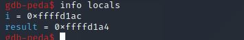
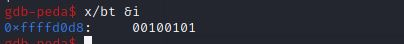

### Exercise 1: Kernel features
__a) What is your current kernel version? and which kind of security mechanisms does it support to prevent or to mitigate the risk of stack-based buffer overflow exploits?__
__Solution :__ 
- To check your kernal version use command `uname -a`
  
 - 
 - It supports 
   - ASLR - Address Space Layout Randomization, Random assignment of Addresses like heap, stack, libraries, main excecutable.
   - Data execution prevention ( NX never execute )
   - Stack Canaries 
  
__b) Briefly explain how you can disable or circumvent these techniques.?__
__Solution :__ 
- To disable ASLR
  - ```sudo bash -c 'echo "kernel.randomize_va_space = 0" >> /etc/sysctl.conf'```
- To disable Data execution prevention add the following command to your compiling argument 
  - `-z execstack`
- To disable Stack Canaries add the following command to your compiling argument  
  - `-fno-stack-protector`

### Exercise 2: GNU Debugger - Helpful commands

__1) Compile the C program example1.c with gcc the GNU Compiler Collection (or clang) using
the command line : gcc -m32 -fno-stack-protector -z execstack -mpreferred-stack-boundary=2 -ggdb
Explain briefly why we used these options?__ 
- Compile and run
  


- `-m32` : to generate a 32 bit binary.
- `-fno-stack-protector` : disable the stack canaries
- `-z execstack` : to disable Data execution prevention so that the content in stack can be executed.
- `-mpreferred-stack-boundary=2` would align the stack by 4 bytes so that it becomes more consistent and easier to exploit.
- `ggdb`:  produces debugging information specifically intended for **gdb**

__2) Load the program in gdb and run it. Indicate how you achieved this.__


- Using the script [PEDA](https://github.com/longld/peda) with gdb.
  
__3)  Set a break point at the function `mult()`.__


__4) Set a break point at a specific position within this function.__

- To set a break point at 10th instruction of mult()


__5) List the source code at the positions you set the breakpoints.__


__6) List all breakpoints you set so far..__


__7) Delete the second break point.__


__8) Run the program and print the local variables after the program has entered mult() for the
first time. Explain your results.__



- Garbage values are stored in local variables before initialization.

__9) Print the content of one single variable.__


__10) Print the content of the variables of interest during the execution of the for-loop in
mult().(three iterations only!)__


__11) Set a new break point at printHello() and execute the program until it reaches this break
point without stepping through every single line of your source code.__


__12) Print the local variable i in binary format.__

__13) Print the last byte of the local variable i in binary format.__

__14) Print the first five characters of the local variable hello in character format.__

__15). Print the content of the local variable hello in hex format.__


### Exercise 3: GNU Debugger - Simple program manipulation

__1) Change the values of i and hello before the printf command in printHello() is executed (check your changes by printing the variables with commands of gdb).__


__2) Change one single character within the string hello to hallo (assigning a new string differing in one character is not accepted here).__


__3) Display the address of printf and try to list the source code at this address. Explain your results and repeat this task with the printHello() function__


- printf is an external function so it didnt list the source code like the printHello (internal function of program).

__4) Use the info command to find out more about the current stack frame.__


__5) Display registers and stack__


**pending**
 ### Exercise 4: Simple buffer overflow - Overwrite local variables

 __1) Shortly explain in your own words, why this program is vulnerable.__
 - The program is vulnerable because it reads user input till it receives EOF and there is no check on input size which will be stored buffer’s size. If the user input size is greater than buffer size, buffer overflow occours.

__2) show attack__


__3) Show a memory layout of the main stack frame, before and after the exploit (draw and explain it).__

- **to do**

__4) Why is this exploit possible and how could a developer have prevented it?__

```c 
  void readInput(char *buf) {
   int offset = 0;
   int ch = 0;
   while((ch = getchar()) != EOF && offset < 20) {
    \\ offset limit can also set dynamically
    buf[offset++] = (char)ch;
   }
  }
```


### Exercise 5: Buffer overflows - Overwrite function pointers

__1) Briefly describe the normal behavior of this program and explain why this program is
vulnerable.__
 - The program expects two cmd line arugments, arg1 will be copied into buffer and arg2 length is checked and passed to **fctPtr** if length is greater than 1 and **fctPtr** points to **printStr** function else points to **printChar**.
 - This program is vulnerable because the arg1 is copied into the stack without checking if the size is less than buffer, can overflow stack and can manuplate what fctPtr points. 

__2) Indicate the input to this program and the tools you used to successfully exploit the program__


__3) Together with your input, outline the stack content before (this is, shortly before your input
manipulates the future program behavior) and after the exploit__

__4) Describe the irregular control flow your input induced (next instruction executed and why).__
the control flow is if the argument2 length is not greater than 1 then i should print Char : a but its pointing to **printStr** so printing **String: a**

__5) Briefly describe a scenario in which you may get full control over a system due to this
vulnerability__

### Exercise 6: Buffer overflows - A more realistic exploit

### Exercise 7: Integer Overflow

__1) Explain why you are able to crash the program and what type of error you encountered.__

- Program expects two arguments arugment1 is passed to `atoi`  and typecasted to short and stored in s.
- size of buffer is 
-  
__2) Briefly explain the input you used to crash the program.__


__3) Correct the code to avoid this vulnerability. Deliver the corrected code!__
- Declare variable s as int 


### Exercise 8: Format string functionality

__1) Roughly outline the stack structure ( position in and allocated size on the stack for all arguments to printf )__

- # **to do**

__2) Use a short sample program and gdb to verify your answers from the last subtask. Deliver a
gdb-printout of the stack ( and your sample program of course ) in which you can identify
and explain the relevant parts and positions of the arguments.__
- Sample program
 ```c
  #include <stdio.h>
  int main(){
   char *somestring = "Some characters";
   printf("An integer:%d,Guess:%f,Some string:%s\n",3141,3.141,somestring);
  }
 ```
- The main stack frame consits of somestring.


__3) Use the last two subtasks to explain the behavior of the given code when you omit the
argument somestring. If possible verify your results with the printf function of gdb.__
