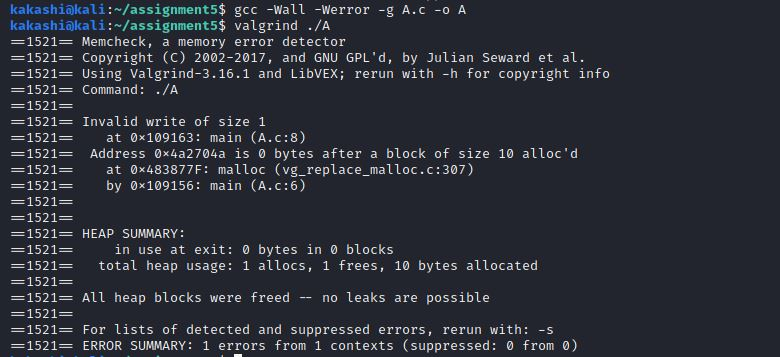
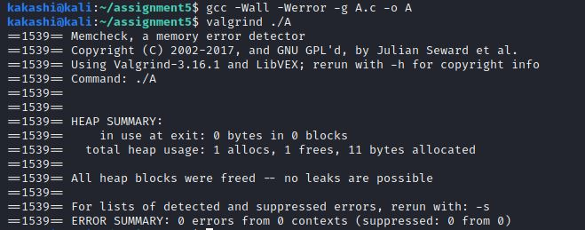
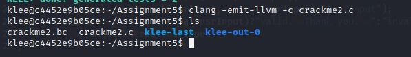
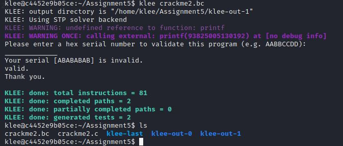

### Exercise 1: Valgrind

__1. Compile the source code and then test the compiled executable with__ 

__2. What errors you detected? What is the name of that category of errors?__

__3. Fix the errors in the source code, recompile and retest it again with Valgrind. Make sure that it does not generate errors this time.__

__Solution:__
- Run A program using following command.
```bash 
gcc -Wall -Werror -g filename.c -o outpufilename
```
- `-Wall` :
- `-Werror` :
- `-g` :

- ### A.c

- **Errors detected**
```bash
   ==1521== Invalid write of size 1
   ==1521==    at 0x109163: main (A.c:8)  
``` 

- **Category of error**
  - `Heap block overrun`: when write data size is more than allocated size this eroor occours.
<br>
- **Error Fix**
```c
char *x;
x = (char *) malloc(11 * sizeof(*x)); // change allocated size from 10 to 11.
x[10] = 'A'; // or can reduce x[10] to x[9].
```
   


- ### B.c

- **Errors detected**
  

- **Category of error**
  -  `Heap block overrun`: when write data size is more than allocated size this eroor occours.
  -  `memory leak` -- when x is not freed after allocation.

</br>

- **Error Fix**
```c
char *x;
x = (char *) malloc(11 * sizeof(char));
x[10] = 'A';
free(x);
```

- ### C.c
- **Errors detected**

- **Category of error**

- **Error Fix**
- ### D.c
- **Errors detected**

- **Category of error**

- **Error Fix**

- ### E.c
- **Errors detected**

- **Category of error**

- **Error Fix**

### Exercise 2: KLEE
- [Build a KLEE Docker image.](https://klee.github.io/docker/)
- To create KLEE Docker container run
`sudo docker run --rm -ti --ulimit='stack=-1:-1' klee/klee`

__1. Include the file ”klee.h” in you source code.__
__2. Choose which variable(s) should be symbolic by using the function” klee_make_symbolic” and adjust the code.__
__Solution :__


- Create crackme2.c file in KLEE container with following code.
   
```c
#include<stdio.h>
#include "klee/klee.h" // add header (question 1)
// crackme2.c
// Sample crackme using a weak hash function for validation
// _______________________________
// Checking if the serial number is valid ?
int checkSerial(int a) {
	if((((((a << 0x15) | (a >> 0x15)) ^ 0xDEADBEEF) + 0xDEADBEEF) == 0x2f5b7b03)){
			// Validated serial number !
			return 1;
		}
	
	return 0;
}
// _______________________________
int main(int argc, char **argv) {
	unsigned int usrInput;
	printf("Please enter a hex serial number to validate this program (e.g. AABBCCDD):\n");
	//scanf("%8x", &usrInput); // commented this line (question 2)
	printf("_____________");
	printf("\nYour serial [%X] is ", usrInput);
	klee_make_symbolic(&usrInput, sizeof(usrInput), "usrInput"); // add this line (question 2)
	printf("%s" ,checkSerial(usrInput)?"valid.\nThank you.\n":"invalid.\n");
	return checkSerial(usrInput) ;
}
```
__3. Compile the source code into LLVM bitcode using for example the command llvm-gcc --emit-llv__



__4. Run KLEE on the resulting LLVM bitcode to generate the test cases.__


`ktest-tool klee-last/test000002.ktest`  gives a valid result.
__5. Use the command ktest-tool on the result cases and decide which one solves the
problem.__


__6. Is this result valid?__

- When `ktest-tool klee-last/test000002.ktest` is ran we obtain a hex value  `object 0: hex : 0x7004605f` 
-  yes, the result is valid. This Hex value is in little indine format so a valid serial key is `5F600470`


__7. Find some (at least three) valid keys and show that they are valid keys by entering them into the original program. Show how you achieved that.__


```c
int checkSerial(int a) {
	if(a!=1600128112) // add the condition to skip the serial which has already been obtained.
	{
		if((((((a << 0x15) | (a >> 0x15)) ^ 0xDEADBEEF) + 0xDEADBEEF) == 0x2f5b7b03)){
			// Validated serial number !
			return 1;
		}
	}
	return 0;
}
```
- Run `klee crackme2.bc` on bytecode of program with above changes.

```bash
klee@fdf5a703251e:~/assignment$ klee crackme2.bc
KLEE: output directory is "/home/klee/assignment/klee-out-8"
KLEE: Using STP solver backend
KLEE: WARNING: undefined reference to function: printf
KLEE: WARNING ONCE: calling external: printf(93825005581152) at crackme2.c:22 2                                                                                                                                                            
Please enter a hex serial number to validate this program (e.g. AABBCCDD):                                                                                                                                                                 
_____________
Your serial [ABABABAB] is invalid.
invalid.
valid.
Thank you.

KLEE: done: total instructions = 120                                                                                                                                                                                                       
KLEE: done: completed paths = 3                                                                                                                                                                                                            
KLEE: done: partially completed paths = 0                                                                                                                                                                                                  
KLEE: done: generated tests = 3                                            
```


